# AGENTS.md

## Table of Contents
1. [Project Overview](#project-overview)
2. [System Purpose & Use Case](#system-purpose--use-case)
3. [Architecture & System Design](#architecture--system-design)
4. [Project Structure](#project-structure)
5. [Hardware Requirements](#hardware-requirements)
6. [Pin Configuration](#pin-configuration)
7. [Dependencies](#dependencies)
8. [Implemented Features](#implemented-features)
9. [Recent Critical Fixes](#recent-critical-fixes)
10. [Planned Features](#planned-features)
11. [Development Environment](#development-environment)
12. [API Documentation](#api-documentation)
13. [Coding Style Guidelines](#coding-style-guidelines)
14. [Component/Feature Creation Rules](#componentfeature-creation-rules)
15. [Compilation and Testing Requirements](#compilation-and-testing-requirements)
16. [Testing & Quality Assurance](#testing--quality-assurance)
17. [Hardware Emulator](#hardware-emulator)
18. [Pull Request and Collaboration Guidelines](#pull-request-and-collaboration-guidelines)
19. [Troubleshooting](#troubleshooting)
20. [Restricted or Sensitive Files](#restricted-or-sensitive-files)
21. [Additional Notes](#additional-notes)

---

## Project Overview

**Coop Controller** is an ESP32-based intelligent automation system designed to manage and monitor a chicken coop environment. The system provides automated control of critical functions including:

- **Temperature Monitoring** - Dual sensor inputs supporting Dallas temperature sensors or water meters with automatic detection
- **Water System Management** - Automated pump control with freeze prevention and water flow monitoring
- **Door Automation** - Motorized door control with safety sensors (planned)
- **Lighting Control** - PWM-based automated lighting with smooth sine-wave transitions; fully implemented with web UI
- **Remote Monitoring** - Web-based UI with real-time status updates
- **Alert System** - Email/Telegram notifications for critical events (planned)
- **AI Integration** - Weather-based decision making for daily operations (planned)

The project uses Platform.io for firmware development and features a modern SolidJS web interface with Tailwind CSS styling. All settings are configurable through the web UI and persisted in LittleFS storage.

**Implementation Status:**

- Phase 3 (Hardware I/O): 100% complete
- Phase 3.5 (Critical Refactoring): 100% complete - HAL refactoring complete, all ESP32-specific functions abstracted
- Phase 3.5a (Sunrise/Sunset Integration): 100% complete with accurate UTC to local time conversion
- Phase 3.5b (Light Control with Web UI): 100% complete
- Phase 3.5c (Desktop Unit Testing): 100% complete - All 452 desktop unit tests passing, all 10 core components covered
- Core features: Sensors, Pump, Light, Door, Buzzer, WiFi, WebServer, SunriseSunset, Settings, Logger controllers fully implemented
- Current build: RAM 17.2% (56,436 bytes), Flash 82.5% (1,081,881 bytes)
- HAL refactoring complete: Desktop unit testing infrastructure fully functional with MockHAL and ArduinoFake
- Actual functionality hasn't been checked for correctness

**Current Test Coverage (January 2026):**

- **Desktop Unit Tests:** 452/452 tests passing (100% pass rate) - 10 components covered:
  - BuzzerController (3 tests)
  - CoopControllerWebServer (15 tests)
  - DoorController (59 tests)
  - LightController (95 tests)
  - Logger (12 tests)
  - PumpController (77 tests)
  - SensorManager (7 tests)
  - SettingsManager (83 tests)
  - SunriseSunset (35 tests)
  - WifiController (66 tests)
- **Embedded Unit Tests:** 1/1 passing - Logger singleton pattern test
- **Test Infrastructure:** Complete mocking framework with MockHAL, MockSensorManager, MockBuzzerController

**Key References:**
- ESP32 pin functions defined in [`platformio.ini`](platformio.ini:45)
- Pin layout reference: [`docs/esp32_devkitC_v4_pinlayout.png`](docs/esp32_devkitC_v4_pinlayout.png)
- Setup instructions in [`README.md`](README.md:1)

---

## System Purpose & Use Case

### Primary Purpose
This system automates chicken coop management to ensure optimal bird health, safety, and egg production while minimizing manual intervention.

### Key Functions

**1. Freeze Prevention (Active)**
- Monitors ambient temperature via sensors (Dallas temperature or water meter inputs)
- When temperature drops below threshold (default 34°F), pump activates in cycling mode
- Circulates warm water through watering system to prevent freezing
- Water meter verifies pump operation and detects frozen/blocked/empty lines
- Configurable cycling intervals (default: 5 min ON / 10 min OFF)

**2. Door Security (Planned)**
- Opens door early in the day based on conditions
- Closes after sunset to secure chickens from predators
- AI-powered daily door recommendations based on weather forecast that the user can choose to accept theough the web UI, Telegram or email
- Hall effect sensors ensure proper open/closed positioning
- Current monitoring for fault detection (motor stall/obstruction)
- Daily confirmation via Telegram/Email/Web UI/Home Assistant

**3. Lighting for Production (Active)**
- Extends daylight exposure during darker seasons
- PWM dimming with gradual sine-curve transitions
- Automatic scheduling based on configurable ON/OFF hours
- Manual override capabilities with timers
- Smooth fade-in/fade-out for bird comfort

**4. Monitoring & Alerts (Planned)**
- Real-time status via web UI
- Email/Telegram notifications for critical events (pump faults, sensor failures, API errors)
- Daily status reports with forecast and automated action plan
- Home Assistant integration for smart home interoperability

### Design Philosophy
The system aims for **mostly automated, AI-driven operation** with minimal daily human confirmation, primarily for the security-critical door operation. It leverages weather forecasts, temperature sensors, and historical data to make intelligent decisions while allowing manual overrides when needed.

---

## Architecture & System Design

### System Architecture

```mermaid
graph TB
    subgraph "Hardware Layer"
        ESP32[ESP32 DevKit C v4]
        TEMP1[Dallas Temp Sensor 1]
        TEMP2[Dallas Temp/Water Meter 2]
        PUMP[Water Pump Relay]
        DOOR[Door Motor DRV8833]
        LIGHT[Light PWM Output]
        HALL1[Hall Sensor Open]
        HALL2[Hall Sensor Closed]
        BUZZER[Buzzer Alert]
    end
    
    subgraph "Firmware Components"
        MAIN[main.cpp]
        TEMP_MGR[SensorManager]
        PUMP_CTRL[PumpController]
        DOOR_CTRL[DoorController]
        LIGHT_CTRL[LightController]
        SETTINGS[SettingsManager]
        LOGGER[Logger System]
        WEB[WebServer]
        WIFI[WiFi Manager]
    end
    
    subgraph "External Services"
        WEATHER[OpenWeather API]
        AI[OpenAI Compatible API]
        EMAIL[SMTP Email]
        TELEGRAM[Telegram Bot]
        SYSLOG[Syslog Server]
        HASS[Home Assistant MQTT]
    end
    
    subgraph "User Interfaces"
        WEBUI[SolidJS Web UI]
        MOBILE[Mobile Browser]
        HA[Home Assistant]
        BOT[Telegram Commands]
    end
    
    ESP32 --> TEMP1
    ESP32 --> TEMP2
    ESP32 --> PUMP
    ESP32 --> DOOR
    ESP32 --> LIGHT
    ESP32 --> HALL1
    ESP32 --> HALL2
    ESP32 --> BUZZER
    
    MAIN --> TEMP_MGR
    MAIN --> PUMP_CTRL
    MAIN --> DOOR_CTRL
    MAIN --> LIGHT_CTRL
    MAIN --> SETTINGS
    MAIN --> LOGGER
    MAIN --> WEB
    MAIN --> WIFI
    
    TEMP_MGR --> TEMP1
    TEMP_MGR --> TEMP2
    PUMP_CTRL --> PUMP
    DOOR_CTRL --> DOOR
    DOOR_CTRL --> HALL1
    DOOR_CTRL --> HALL2
    LIGHT_CTRL --> LIGHT
    
    WEB --> WEBUI
    WEB --> MOBILE
    WEBUI --> SETTINGS
    
    MAIN --> WEATHER
    MAIN --> AI
    MAIN --> EMAIL
    MAIN --> TELEGRAM
    LOGGER --> SYSLOG
    MAIN --> HASS
    
    BOT --> MAIN
    HA --> HASS
```



### Component Interactions

**Core Loop Flow:**
1. **WiFi Management** - Maintains connection, falls back to AP mode if needed
2. **Sensor Updates** - Reads temperature/water flow every 5 seconds
3. **Pump Control** - Updates pump state every 1 second based on temperature and flow
4. **Web Server** - Handles HTTP requests, serves UI, processes OTA updates
5. **Logging** - Maintains in-memory buffer, optional syslog forwarding

**Data Flow:**
- Sensors → SensorManager → PumpController → Physical Output
- User Input (Web UI) → WebServer → SettingsManager → LittleFS Storage
- Status Queries → WebServer → Components → JSON Response
- Alerts → Logger → Syslog/Email/Telegram (when implemented)

**State Management:**
- All user settings persisted to [`data/user_settings.json`](data/user_settings.json) in LittleFS
- Pump statistics tracked in-memory (reset on reboot or manual reset)
- WiFi credentials stored separately from system settings
- Log entries kept in circular buffer (max 150 entries)

---

## Project Structure

```
coop_controller/
├── lib
|   ├── BuzzerController 
│   |   ├── BuzzerController.cpp
│   |   ├── BuzzerController.h      # Buzzer control (planned)
│   |   ├── library.json
|   ├── DoorController 
│   |   ├── DoorController.cpp
│   |   ├── DoorController.h        # Door automation (planned)
│   |   ├── library.json
|   ├── LightController 
│   |   ├── LightController.cpp
│   |   ├── LightController.h       # Light control (implemented)
│   |   ├── library.json
|   ├── Logger 
│   |   ├── library.json
│   |   ├── Logger.cpp
│   |   ├── Logger.h                # Logging system
│   ├── PumpController 
│   |   ├── library.json
│   |   ├── PumpController.cpp
│   |   ├── PumpController.h        # Pump control logic
│   ├── SensorManager 
│   |   ├── library.json
│   |   ├── SensorManager.cpp
│   |   ├── SensorManager.h         # Temperature/water meter handling
|   ├── SettingsManager 
│   |   ├── library.json
│   |   ├── SettingsManager.cpp
│   |   ├── SettingsManager.h       # Configuration management
|   ├── SunriseSunset 
│   |   ├── library.json
│   |   ├── SunriseSunset.cpp
│   |   ├── SunriseSunset.h         # Sunrise/sunset calculations
|   ├── WebServer 
│   |   ├── library.json
│   |   ├── WebServer.cpp
│   |   ├── WebServer.h             # HTTP server and REST API
│   └── WifiController 
│       ├── library.json
│       └── WifiController.cpp      # WiFi implementation (new)
│       └── WifiController.h        # WiFi management (new)
│
├── src/                        # Implementation files
│   └── main.cpp                # Main entry point and loop
│
├── data/                       # Filesystem data (LittleFS)
│   ├── assets/                 # Web UI static assets (built)
│   ├── favicon.ico.gz          # Compressed favicon
│   ├── index.htm               # Web UI entry (built from web/)
│   └── user_settings.example.json  # Template settings file
│
├── web/                        # SolidJS web application
│   ├── src/
│   │   ├── About.tsx           # About page with library attributions
│   │   ├── App.tsx             # Main app component
│   │   ├── Logs.tsx            # Log viewer
│   │   ├── Settings.tsx        # Settings management UI
│   │   ├── Status.tsx          # Real-time status dashboard
│   │   └── Update.tsx          # OTA update interface
│   ├── scripts/
│   │   └── gzip-files.cjs      # Build script for asset compression
│   ├── devServer.js            # Mock API server for development
│   ├── package.json            # Node dependencies
│   └── vite.config.ts          # Vite build configuration
│
├── build_scripts/              # Build automation
│   ├── build_web.py            # Builds web UI and copies to data/
│   ├── post_build.py           # Post-build processing
│   └── merge_bin.py            # Binary merging for releases
│
├── test/                       # Unit tests for various test including library/module tests
│   ├── test_common 
│   |   ├── test_main.cpp
|   ├── test_embedded 
│   |   ├── test_main.cpp
|   └── test_desktop 
│       └── test_main.cpp
|
│
├── platformio.ini              # PlatformIO configuration
├── README.md                   # User documentation
├── Agents.md                   # This file - AI assistant context
└── docs/                       # Documentation and references - temp_*.md, *.lnk and *.url files are gitignored
    ├── temp_XXXX.md            # Temporary planning and status/progress documents
    └── esp32_devkitC_v4_pinlayout.png  # Hardware reference
```

### File Organization Principles

- **Headers (include/)** - Class definitions and public interfaces
- **Source (src/)** - Implementation details (mainly just `main.cpp` here)
- **Libraries (lib/)** - Modular components for specific functionality, separated for testing and reuse
- **Data (data/)** - Runtime files deployed to ESP32 filesystem
- **Web (web/)** - Complete web application with dev server
- **Tests (test/)** - Unit tests using Google Test framework for desktop/native builds and UnitTest for embedded tests
- **Build Scripts** - Automation for building and deploying

---

## Hardware Requirements

### Microcontroller
- **Board:** ESP32 DevKit C v4
- **Chip:** ESP32-WROOM-32
- **Flash Memory:** 4MB recommended (for LittleFS storage)
- **RAM:** 520KB SRAM
- **Clock:** 240MHz dual-core
- **WiFi:** 802.11 b/g/n 2.4GHz
- **GPIO:** Multiple GPIO pins with PWM, ADC, I2C, SPI support

### Peripheral Modules

**Current Implementation:**
- **Dallas DS18B20 Temperature Sensors** (1-Wire protocol)
  - Operating range: -55°C to +125°C (-67°F to +257°F)
  - Resolution: 9-12 bit configurable
  - Pullup resistor required (4.7kΩ typical)

- **Water Flow Meter** (Pulse output)
  - Example: YF-S201 or similar
  - Configurable pulses-per-gallon ratio
  - 3-wire connection (VCC, GND, Signal)
  - Interrupt-driven pulse counting

- **MosFET** (for pump control)
  - N-Channel on ground
  - Current capacity suitable for pump

**Planned Implementation:**
- **DRV8833 Dual H-Bridge Motor Driver** (door control)
  - Two outputs for bidirectional motor control
  - No current sensing capability
  - Fault detection

- **Hall Effect Sensors** (door position sensing)
  - Digital output (HIGH/LOW)
  - Two sensors: fully open and fully closed positions

- **LED Lighting** (PWM controlled)
  - PWM-dimmable LED strips or bulbs
  - MOSFET driver if high current

- **Buzzer** (alert notifications)
  - Active or passive buzzer
  - 5V or 3.3V compatible

### Power Supply
- ESP32: 3.3V regulated (onboard regulator from 5V USB or VIN)
- Peripherals: 5V for relays, sensors (provide adequate current capacity)
- Motor: Voltage according to door motor specifications (via DRV8833)
- 12VDC for light
- **Note:** Power requirements vary based on connected peripherals

### Wiring Reference
See [`docs/esp32_devkitC_v4_pinlayout.png`](docs/esp32_devkitC_v4_pinlayout.png) for detailed pin layout and capabilities.

---

## Pin Configuration

All pins are defined in [`platformio.ini`](platformio.ini:45) as build flags and can be referenced in code using the defined constants. Inputs/outputs are active high unless marked outherwise, such as "_B" for active low.

### Currently Configured Pins

| Pin | Constant | Function | Type | Notes |
|-----|----------|----------|------|-------|
| 32 | TEMP_METER_PIN | Sensor 1 Input | Input+Pullup | Auto-detects Dallas temp or water meter |
| 33 | TEMP_METER_2_PIN | Sensor 2 Input | Input+Pullup | Auto-detects Dallas temp or water meter |
| 26 | OUT_PUMP_PIN | Pump Control | Output | Relay control for water pump |
| 25 | OUT_LIGHT_PIN | Light Control | PWM Output | LEDC channel 0, 5kHz, 8-bit resolution |

### Pins Defined for Future Implementation

| Pin | Constant | Function | Type | Status |
|-----|----------|----------|------|--------|
| TBD | WIFI_LED_B_PIN | WiFi Status LED | Output | Heartbeat when connected, active low, fast blink when disconnected |
| TBD | BUZZER_B_PIN | Alert Buzzer | Output | Sounds on fault conditions, active low |
| TBD | OUT_DOOR_A_OPEN_POS_PIN | Door Open Positive | Output | Drive motor to open door (polarity reversed to close) |
| TBD | OUT_DOOR_A_OPEN_NEG_PIN | Door Open Negative | Output | Drive motor negative to open door (polarity reversed to close) |
| TBD | DOOR_A_FAULT_B_PIN | Door Fault Input | Input | Active LOW on fault detected by DRV8833 driver board |
| TBD | DOOR_MANUAL_SWITCH_B_PIN | Door Manual Control Input | Input | Momentary switch to toggle door open/close |
| TBD | DOOR_A_HALL_SENSOR_OPEN_B_PIN | Door Fully Open Sensor | Input | Hall effect sensor, active low - door fully open |
| TBD | DOOR_A_HALL_SENSOR_CLOSED_B_PIN | Door Fully Closed Sensor | Input | Hall effect sensor, active low - door fully closed |

### Development Notes

- **Ambiguities:** Any ambiguities or questions should be clarified before coding
- **Web UI Settings:** Should be stored in [`data/user_settings.json`](data/user_settings.json), NOT hardcoded in firmware
- **Build Process:** PlatformIO commands build the C++ firmware (pio run) and npm builds the web UI (cd web && npm run build)
- **C++ Standard:** Code uses C++11 (`-std=gnu++11` in platformio.ini)
- **Compatibility:** Ensure C++ code is ESP32-compatible while using modern features where appropriate

### PlatformIO Configuration Changes

**MANDATORY APPROVAL REQUIREMENT:** Any modifications to `platformio.ini` (build flags, pins, libraries, etc.) must be proposed first with detailed justification and require explicit user approval before implementation. This prevents unintended hardware conflicts or configuration changes.

**Required Approval Process:**
1. **Documentation Update First:** Propose changes in documentation updates before any code implementation
2. **Detailed Justification:** Clearly explain the purpose, hardware implications, and necessity of each change
3. **Conflict Analysis:** Verify no conflicts with existing pin assignments or ESP32 reserved pins
4. **User Confirmation:** Use ask_followup_question to get explicit approval before implementing platformio.ini changes

**Examples Requiring Approval:**
- Pin definitions: `-DBUZZER_B_PIN=27` or `-DOUT_DOOR_A_OPEN_POS_PIN=14`
- Library additions or version changes
- Build flag modifications affecting compilation
- Upload protocol or port configuration changes

**Temporary Implementation Guidelines:**
- For development: All pins should be defined in platformio.ini using `-D` flags
- For production: Propose platformio.ini build flags after approval
- Request approval via orchestrator before finalizing any platformio.ini modifications

**Hardware Pin Approval Guidelines:**
1. **Pin Availability:** Ensure available, non-conflicting pins chosen (check reserved pins table)
2. **Hardware Compatibility:** Validates with specified sensor or device
3. **Interrupt Needs:** Supports interrupt-driven configurations if used
4. **Development Testing:** Tested in development with platformio.ini changes only after approval with conflicting values commented out if the change is temporary
5. **Documentation Update:** Added to this file before platformio.ini change

### Hardware Pin Approval Guidelines

Before adding new hardware pins, developers must:

1. **Pin Availability Verification:** Check against existing pin assignments and ESP32 reserved pins
2. **Documentation Update:** Add proposed pins to "Pins Defined for Future Implementation" table in this file first
3. **User Approval Request:** Use ask_followup_question to get explicit approval for platformio.ini changes
4. **Conflict Prevention:** Avoid boot pins (GPIO 0, 2, 15) and SPI flash pins (GPIO 6-11)
5. **Development Guidelines:** For temporary development, pins changes should be defined in platformio.ini with conflicts commented out with approval, but production implementation requires platformio.ini approval

---

## Dependencies

All dependencies are managed through PlatformIO and defined in [`platformio.ini`](platformio.ini:19).

### Core Libraries

| Library | Version | Purpose | Repository |
|---------|---------|---------|------------|
| `arduino` | framework | Arduino framework for ESP32 | Built-in |
| `espressif32` | platform | ESP32 platform support | Built-in |

### Communication & Networking

| Library | Version | Purpose |
|---------|---------|---------|
| `WiFi` | Built-in | WiFi connectivity |
| `ESPmDNS` | Built-in | mDNS for local network discovery |
| `esp32async/AsyncTCP` | 3.4.7 | Asynchronous TCP library |
| `esp32async/ESPAsyncWebServer` | 3.8.0 | Async HTTP web server |
| `SimpleSyslog` | 0.1.3 | Syslog client for remote logging |
| `mobizt/ReadyMail` | 0.3.6 | SMTP email client |
| `cotestatnt/AsyncTelegram` | 1.1.3 | Telegram bot integration |

### Data & Storage

| Library | Version | Purpose |
|---------|---------|---------|
| `LittleFS` | Built-in | Filesystem for ESP32 |
| `bblanchon/ArduinoJson` | 7.4.2 | JSON serialization/deserialization |
| `SettingsManager` | Local | Persistent configuration management |

### Sensors & I/O

| Library | Version | Purpose |
|---------|---------|---------|
| `milesburton/DallasTemperature` | 4.0.4 | Dallas DS18B20 temperature sensors |
| `OneWire` | Dependency | 1-Wire protocol implementation |

### OTA & Updates

| Library | Version | Purpose |
|---------|---------|---------|
| `ArduinoOTA` | Built-in | Arduino OTA updates |
| `ayushsharma82/ElegantOTA` | 3.1.7 | Web-based OTA with UI |

### Utilities

| Library | Version | Purpose |
|---------|---------|---------|
| `robtillaart/UUID` | 0.2.0 | UUID generation for log entries |
| `jpb10/SolarCalculator` | 2.0.2 | Sunrise/sunset calculations |
| `dawidchyrzynski/home-assistant-integration` | 2.1.0 | Home Assistant MQTT integration |

### Web UI Dependencies

Managed via npm in [`web/package.json`](web/package.json:1):

**Runtime:**
- `solid-js` 1.9.5 - Reactive UI framework
- `@solidjs/router` 0.15.3 - Client-side routing
- `tailwindcss` 4.1.10 - Utility-first CSS framework
- `@tailwindcss/vite` 4.1.10 - Vite integration for Tailwind
- `radix-ui` 1.4.2 - Unstyled UI components

**Development:**
- `vite` 6.2.0 - Build tool and dev server
- `vite-plugin-solid` 2.11.2 - SolidJS plugin for Vite
- `typescript` 5.7.2 - Type safety
- `daisyui` 5.0.43 - Component library for Tailwind
- `express` 5.1.0 - Mock API server for development
- `nodemon` 2.0.22 - Auto-restart dev server
- `shx` 0.4.0 - Cross-platform shell commands

---

## Implemented Features

### Core Components

#### SensorManager ([`SensorManager.h`](include/SensorManager.h:1) / [`SensorManager.cpp`](src/SensorManager.cpp))
- **Dual-purpose sensor inputs** - Automatically detects and configures Dallas DS18B20 temperature sensors or water meter pulse inputs on startup. Each pin is independently tested for Dallas sensor first; if none found, it's configured as a water meter input.
- **Temperature readings** - Fahrenheit conversion from Celsius with configurable thresholds,TODO: add setting to display in web UI either C or F
- **Water flow monitoring** - Interrupt-driven pulse counting with atomic operations for thread safety
- **Flow rate calculation** - Gallons per minute based on pulse frequency (60-second calculation interval, TODO: make configurable from UI)
- **Per-pulse calculation** - Optional instantaneous flow measurement calculated after every pulse instead of waiting for fixed intervals, with noise filtering (10ms threshold) and no-flow timeout detection (5 seconds)
- **Noise filtering** - 10ms minimum pulse interval filters electrical noise from water meter signals
- **No-flow timeout** - Automatically detects when flow has stopped (no pulses for 5 seconds)
- **Rollover handling** - Proper millis() overflow handling ensures correct calculations after extended runtime
- **Thread-safe** - Atomic operations protect shared variables in interrupt context
- **Backward compatible** - Default disabled, users can enable via web UI settings
- **Configurable calibration** - Pulses-to-gallons conversion factor (TODO: make configurable from UI)
- **Real-time status** - Connection state, sensor type, readings, pulse counts

#### PumpController ([`PumpController.h`](include/PumpController.h:1) / [`PumpController.cpp`](src/PumpController.cpp))
- **Temperature-based automation** - Activates pump when temperature drops below ON threshold (default 34°F)
- **Hysteresis control** - Separate ON/OFF thresholds prevent rapid cycling (default 34°F/36°F)
- **Cycling mode** - Configurable ON/OFF intervals when below threshold (default 5min/10min)
- **Manual control modes** - Force ON, force OFF, or AUTO mode
- **Flow error detection** - Monitors water flow when pump runs; detects frozen/blocked/empty lines
- **Automatic error handling** - Stops pump on flow error, retries on next cycle
- **Statistics tracking** - Total ON/OFF time, cycle counts, current cycle duration
- **State persistence** - Maintains state across updates
- **Pump OFF flow monitoring** - Monitors for water flow when pump is OFF to detect hardware faults (stuck relay, valve leak) with configurable grace period and warning alerts

#### SettingsManager ([`SettingsManager.h`](include/SettingsManager.h:1) / [`SettingsManager.cpp`](src/SettingsManager.cpp))
- **Persistent storage** - JSON-based configuration in LittleFS
- **Singleton pattern** - Single global instance accessible via macro
- **WiFi credentials** - SSID, password, AP mode settings
- **System parameters** - Temperature thresholds, pump timings, flow error timeout
- **Auto mode flags** - Enable/disable automatic pump and light control
- **Debug settings** - Toggle debug logging
- **WiFi recovery** - Retry parameters, AP fallback duration
- **Immediate save** - Settings persisted on change
- **Example template** - [`user_settings.example.json`](data/user_settings.example.json) for reference

#### WebServer ([`WebServer.h`](include/WebServer.h:1) / [`WebServer.cpp`](src/WebServer.cpp))
- **Async HTTP server** - Non-blocking request handling using ESPAsyncWebServer
- **REST API** - JSON endpoints for status, settings, and control
- **Static file serving** - Serves SolidJS web UI from LittleFS
- **OTA support** - Both ArduinoOTA (network) and ElegantOTA (web-based)
- **OTA authentication** - Optional password protection for updates
- **mDNS** - Local discovery at `coopcontroller.local`
- **CORS enabled** - Supports cross-origin requests for development

#### Logger System ([`Logger.h`](include/Logger.h:1) / [`Logger.cpp`](src/Logger.cpp))
- **In-memory buffer** - Circular buffer for last 150 log entries
- **UUID tracking** - Unique identifier for each log entry
- **Timestamp support** - NTP-synchronized timestamps when available
- **Level-specific methods** - logInfo(), logWarning(), logError(), logDebug(), logVerbose() for clear severity indication
- **Automatic filtering** - Debug and verbose messages filtered based on settings
- **JSON export** - REST endpoint for web UI consumption
- **Syslog integration** - Optional remote logging to syslog server
- **Serial output** - Simultaneous logging to Serial monitor

#### LightController ([`LightController.h`](include/LightController.h:1) / [`LightController.cpp`](src/LightController.cpp))
- **PWM dimming control** - ESP32 LEDC (LED Control) peripheral with 8-bit resolution
- **Sine curve transitions** - Smooth fade-in/fade-out following natural lighting curves for auto mode
- **Immediate manual response** - Manual controls work instantly without unwanted fade transitions
- **Configurable timing** - Separate ON/OFF hours with transition duration settings
- **Manual control modes** - Force ON, force OFF, or AUTO mode
- **Timer functionality** - Manual ON with configurable duration (15min, 30min, 1hr, 2hr, 4hr)
- **State machine** - Handles OFF, FADING_IN, ON, FADING_OUT, MANUAL states
- **Settings integration** - Auto mode flag, brightness levels, ON/OFF hours, fade duration
- **REST API** - Manual control endpoints and status reporting
- **Web UI complete** - Full implementation in Status.tsx (controls) and Settings.tsx (configuration)

#### SunriseSunset ([`SunriseSunset.h`](include/SunriseSunset.h:1) / [`SunriseSunset.cpp`](src/SunriseSunset.cpp))
- **Accurate calculations** - Uses SolarCalculator library for precise sunrise/sunset times
- **UTC to local time** - Automatic conversion from UTC to configured timezone offset
- **Location-based** - Configurable latitude/longitude in settings
- **Timezone support** - User-configurable UTC offset (e.g., -7 for Mountain Time)
- **Automatic updates** - Recalculates when location or timezone settings change
- **Web UI display** - Shows current sunrise/sunset times in Status and Settings pages
- **Ready for automation** - Foundation for door scheduling and light timing enhancements

### Sensor Management
- Automatic sensor type detection on startup (Dallas temperature vs water meter) - Each pin independently tested for Dallas sensor first; if none found, configured as water meter
- Temperature readings in Fahrenheit with user-configurable thresholds
- Water flow rate calculation in GPM and pulse counting
- Real-time sensor status monitoring and error detection
- Independent operation of two sensors (different types allowed)

### Pump Control Logic
- Temperature-based automatic cycling mode with hysteresis (separate ON/OFF thresholds)
- Manual ON/OFF/AUTO control modes via web UI or REST API
- Flow error detection with automatic pump shutdown when no flow detected
- Configurable flow error timeout (default 120 seconds)
- Automatic retry after configurable delay (default 120 seconds)
- Comprehensive statistics tracking (total on/off time, cycle counts, current state)
- Configurable cycling intervals (on/off times in seconds)
- State machine implementation for reliable state transitions

### Web Interface
- **Real-time status dashboard** - Sensor readings, pump state, light status, sunrise/sunset times, system info
- **Auto-refresh** - Status updates every 2.5 seconds
- **Manual pump controls** - ON/OFF/AUTO buttons with immediate feedback
- **Light controls** - ON/OFF/AUTO buttons, timer selection, brightness display
- **Sunrise/Sunset display** - Shows calculated times based on location and timezone
- **Settings management** - All system parameters configurable including light settings
- **WiFi configuration** - SSID/password entry with AP mode fallback
- **System logs** - Scrollable log viewer with timestamps
- **OTA updates** - Firmware and filesystem update interface
- **Responsive design** - Tailwind CSS with DaisyUI components
- **Dark mode support** - Modern, professional UI

#### WifiController ([`WifiController.h`](include/WifiController.h:1) / [`WifiController.cpp`](src/WifiController.cpp))
- **Automatic connection** - Connects to saved SSID on boot
- **Retry logic** - Configurable retry count and delay
- **AP mode fallback** - Creates `CoopController` WiFi network when connection fails
- **Connection persistence** - Tracks successful connections to avoid unneeded AP mode
- **Automatic reconnection** - Monitors connection and retries if dropped
- **mDNS support** - Accessible at `coopcontroller.local` on local network
- **Configurable timeouts** - AP mode duration, retry intervals
- **Clean separation** - Extracted from main.cpp for better code organization
- **Encapsulated state** - All WiFi-related globals moved into controller class

---

## Recent Critical Fixes

Recent bug fixes and improvements that addressed critical issues:

### 1. Sunrise/Sunset UTC to Local Time Conversion
**Issue:** Sunrise/sunset calculations were displaying incorrect times due to UTC conversion errors.

**Fix:**
- Implemented proper UTC to local time conversion using timezone offset
- Added automatic recalculation when location or timezone settings change
- Calculations now accurately reflect user's local time
- Web UI displays correct sunrise/sunset times in Status and Settings pages

**Status:** ✅ Complete

### 2. Light Control Regression - Manual vs Auto Mode Fading
**Issue:** Manual light controls were triggering unwanted fade transitions, making immediate control difficult. Auto mode wasn't properly using sine-wave fades.

**Fix:**
- Manual controls (ON/OFF/Timer) now respond immediately without fade transitions
- Auto mode properly implements sine-wave fade-in/fade-out for natural lighting
- State machine correctly differentiates between MANUAL and AUTO states
- User can now immediately control lights when needed while auto mode provides smooth transitions

**Status:** ✅ Complete

### 3. Component Naming Refactoring
**Issue:** Component names didn't accurately reflect their functionality, causing confusion.

**Changes:**
- `TempSensor` → [`SensorManager`](include/SensorManager.h:1) - Better reflects dual-purpose sensor management
- `Buzzer` → [`BuzzerController`](include/BuzzerController.h:1) - Consistent naming with other controllers
- `Light` → [`LightController`](include/LightController.h:1) - Consistent naming with other controllers

**Benefits:**
- Improved code clarity and maintainability
- Consistent naming pattern across all controller classes
- More accurate representation of component responsibilities

**Status:** ✅ Complete

### 4. WiFi Controller Refactoring
**Issue:** WiFi management code was scattered throughout main.cpp, making it difficult to maintain and understand.

**Fix:**
- Extracted all WiFi functionality from main.cpp to dedicated WifiController class
- Moved WiFi-related global variables into WifiController encapsulation
- Implemented proper initialization through begin() method
- Maintained existing functionality while improving code organization
- Other components now use clean WifiController interface

**Benefits:**
- Improved code organization and separation of concerns
- Easier to maintain and test WiFi functionality
- Consistent controller pattern across all system components
- Reduced complexity in main.cpp

**Status:** ✅ Complete

### 5. Logger Method Refactoring
**Issue:** Logger used generic log() and logf() methods without clear severity indication, requiring conditional debug checks throughout code.

**Fix:**
- Replaced all logger.log() and logger.logf() calls with level-specific methods
- Introduced logInfo(), logWarning(), logError(), logDebug(), logVerbose() methods
- Removed conditional debug if/then blocks - logger methods now handle filtering internally
- Improved log message clarity and consistency
- All critical events now logged at appropriate severity levels

**Benefits:**
- Clearer code with explicit log severity
- Eliminated repetitive conditional debug checks
- Improved log filtering and organization
- Better debugging and troubleshooting capabilities
- Consistent logging patterns throughout codebase

**Status:** ✅ Complete

### 6. HAL (Hardware Abstraction Layer) Refactoring
**Issue:** Direct ESP32 API calls throughout the codebase made unit testing impossible without physical hardware and created tight coupling to ESP32-specific implementations.

**Solution:**
- Created comprehensive HAL interface ([`IHAL.h`](lib/HAL/IHAL.h)) with 31 methods abstracting all ESP32-specific functionality
- Implemented ESP32 HAL ([`HAL_ESP32`](lib/HAL_ESP32/)) with full ESP32 API support
- Created mock HAL implementation ([`MockHAL.h`](test/common/mocks/MockHAL.h)) for desktop testing
- Refactored core components to use HAL interface:
  - [`SettingsManager`](lib/SettingsManager/SettingsManager.h) - Uses HAL for filesystem operations
  - [`WifiController`](lib/WifiController/WifiController.h) - Uses HAL for WiFi operations
  - [`CoopControllerWebServer`](lib/CoopControllerWebServer/CoopControllerWebServer.h) - Uses HAL for web server operations
  - [`LightController`](lib/LightController/LightController.h) - Uses HAL for LEDC PWM control
- Partially refactored [`main.cpp`](src/main.cpp) - Only `esp_reset_reason` replaced with HAL call
- Watchdog functions remain unabstracted (not critical for testing)

**HAL Interface Methods (31 total):**
- **Filesystem:** `fileExists()`, `readFile()`, `writeFile()`, `deleteFile()`, `listFiles()`
- **Web Server:** `createWebServer()`, `on()`, `send()`, `send_P()`, `sendChunked()`, `clientIP()`, `uri()`, `method()`, `arg()`, `hasArg()`, `args()`, `header()`, `hasHeader()`, `headers()`, `authenticate()`, `requestAuthentication()`, `setBasicAuth()`, `serveStatic()`, `serveStaticFromLittleFS()`
- **WiFi:** `WiFiStatus()`, `WiFiSSID()`, `WiFiLocalIP()`, `WiFiMode()`, `beginWiFi()`, `disconnectWiFi()`, `scanNetworks()`
- **LEDC:** `ledcSetup()`, `ledcAttachPin()`, `ledcWrite()`, `ledcDetachPin()`
- **System:** `getResetReason()`, `getFreeHeap()`, `getChipModel()`, `millis()`, `delay()`, `random()`

**Build Verification Results:**
- **ESP32 Build:** ✅ SUCCESS
  - RAM: 56,444 bytes (17.2%)
  - Flash: 1,085,009 bytes (82.8%)
  - Zero compilation errors or warnings

- **Desktop Tests:** ✅ SUCCESS
  - Total tests run: 2
  - Tests passed: 2 (100% pass rate)
  - Test duration: 32.1 seconds
  - MockHAL implementation verified with all 32 methods

**Benefits:**
- **Desktop unit testing now possible** - Core components can be tested without ESP32 hardware
- **Better code organization** - Clear separation between hardware abstraction and business logic
- **Improved testability** - Mock implementations enable comprehensive unit testing
- **Enhanced maintainability** - Hardware changes isolated to HAL implementation
- **Complete abstraction** - All ESP32-specific functions now abstracted through HAL
- **Minimal memory impact** - RAM increased by 8 bytes, Flash increased by 3,128 bytes

**HAL Interface Methods (32 total):**
- **Filesystem:** `fileExists()`, `readFile()`, `writeFile()`, `deleteFile()`, `listFiles()`
- **Web Server:** `createWebServer()`, `on()`, `send()`, `send_P()`, `sendChunked()`, `clientIP()`, `uri()`, `method()`, `arg()`, `hasArg()`, `args()`, `header()`, `hasHeader()`, `headers()`, `authenticate()`, `requestAuthentication()`, `setBasicAuth()`, `serveStatic()`, `serveStaticFromLittleFS()`
- **WiFi:** `WiFiStatus()`, `WiFiSSID()`, `WiFiLocalIP()`, `WiFiMode()`, `beginWiFi()`, `disconnectWiFi()`, `scanNetworks()`
- **LEDC:** `ledcSetup()`, `ledcAttachPin()`, `ledcWrite()`, `ledcDetachPin()`
- **System:** `getResetReason()`, `getFreeHeap()`, `getChipModel()`, `millis()`, `delay()`, `random()`, `taskWdtReset()`

**Documentation References:**
- HAL Interface: [`lib/HAL/IHAL.h`](lib/HAL/IHAL.h)
- ESP32 Implementation: [`lib/HAL_ESP32/`](lib/HAL_ESP32/)
- Mock Implementation: [`test/common/mocks/MockHAL.h`](test/common/mocks/MockHAL.h)
- HAL Analysis: [`docs/temp_HAL_Analysis.md`](docs/temp_HAL_Analysis.md)
- Web Server HAL Analysis: [`docs/temp_WebServer_HAL_Analysis.md`](docs/temp_WebServer_HAL_Analysis.md)

**Status:** ✅ Complete (100% - All ESP32-specific functions abstracted)

### 7. Sensor Error Handling - Already Implemented
**Investigation:** Review of sensor error handling functionality revealed it was already fully implemented in the codebase.

**Findings:**
- [`SensorManager`](lib/SensorManager/SensorManager.h) detects DEVICE_DISCONNECTED_C (-127.0°C) and sets `is_connected` to false, `temperature_f` to NAN
- [`CoopControllerWebServer`](lib/CoopControllerWebServer/CoopControllerWebServer.h) returns nullptr for `temperature_f` when sensor is disconnected
- [`Status.tsx`](web/src/Status.tsx) displays "---°F" for null/undefined/NaN temperature values
- Web UI properly shows descriptive error messages when sensors are not detected

**Changes Made:**
- Updated [`web/src/types.ts`](web/src/types.ts) to change `temperature_f: number` to `temperature_f: number | null` for proper TypeScript type alignment

**Status:** ✅ Complete (Feature was already implemented, only minor type alignment needed)

### 8. Pump Flow Per-Pulse Calculation
**Issue:** Previous flow rate calculation used fixed 60-second intervals, which provided delayed response to flow changes and couldn't detect rapid flow variations or no-flow conditions in real-time.

**Fix:**
- Added new boolean setting `water_meter_per_pulse_calculation_enabled` (default: false) for backward compatibility
- Implemented per-pulse flow calculation in SensorManager interrupt handlers for instantaneous measurement
- Added noise filtering (10ms threshold) to filter electrical noise and prevent false pulse detection
- Added no-flow timeout detection (5 seconds) to identify when flow has stopped
- Used atomic operations for thread-safe access to shared variables in interrupt context
- Proper millis() rollover handling to ensure correct time calculations after ~49.7 days
- Web UI toggle control with descriptive help text explaining the feature
- Maintains backward compatibility with existing interval-based calculation when disabled

**Key Features:**
- **Instantaneous measurement** - Flow rate calculated after every pulse instead of waiting for fixed intervals
- **Noise filtering** - 10ms minimum pulse interval filters electrical noise from the water meter
- **No-flow timeout** - Automatically detects when flow has stopped (no pulses for 5 seconds)
- **Rollover handling** - Proper millis() overflow handling ensures correct calculations after extended runtime
- **Thread-safe** - Atomic operations protect shared variables in interrupt context
- **Backward compatible** - Default disabled, users can enable via web UI settings
- **Configurable** - Toggle in web UI Settings page with clear explanation

**Build Verification Results:**
- **ESP32 Build:** ✅ SUCCESS
  - RAM: 56,436 bytes (17.2%) - no change
  - Flash: 1,081,881 bytes (82.6%) - increased by 0.1%
  - Zero compilation errors or warnings

- **Web UI Build:** ✅ SUCCESS
  - TypeScript compilation successful
  - All components built without errors
  - Settings page updated with new toggle control

**Benefits:**
- **More responsive flow monitoring** - Detects flow changes immediately instead of waiting for interval
- **Better fault detection** - Can identify flow variations and no-flow conditions in real-time
- **Improved accuracy** - Per-pulse calculation provides more precise flow rate measurements
- **Enhanced reliability** - Noise filtering prevents false readings from electrical interference
- **User control** - Users can choose between interval-based (legacy) or per-pulse (new) calculation

**Status:** ✅ Complete

### 9. Pump Flow Monitoring Enhancement
**Issue:** No monitoring for water flow when pump is OFF, which could indicate hardware faults such as stuck relays or valve leaks.

**Fix:**
- Added new settings: `pump_off_flow_monitoring_enabled` (bool, default: false) and `pump_off_flow_grace_period_seconds` (int, default: 30)
- Implemented pump OFF flow monitoring in PumpController with configurable grace period
- Records timestamp when pump turns OFF and monitors flow rate after grace period elapses
- Logs WARNING message when flow > 0.0 detected while pump is OFF: "WARNING: Water flow detected while pump is OFF - Possible stuck relay or valve leak"
- Added public methods: `getPumpOffFlowDetected()` and `clearPumpOffFlowDetected()`
- Proper millis() rollover handling for long-running systems
- Web UI toggle control with descriptive help text explaining the feature
- Web UI warning alert banner displays when pump off flow is detected, with "Clear Warning" button
- New REST endpoint: `GET /pump/clear_off_flow_detected`

**Key Features:**
- **Grace period** - Configurable delay (default 30 seconds) after pump turns off before monitoring begins to prevent false alarms
- **Hardware fault detection** - Identifies stuck relays, valve leaks, or other hardware issues
- **Automatic reset** - Detection flag automatically clears when pump turns ON
- **Manual acknowledgment** - Users can clear warning via web UI button or REST API endpoint
- **Disabled by default** - Prevents false alarms during normal operation until user enables it

**Build Verification Results:**
- **ESP32 Build:** ✅ SUCCESS
  - RAM: 56,444 bytes (17.2%) - increased by 8 bytes
  - Flash: 1,084,957 bytes (82.8%) - increased by 3,076 bytes
  - Zero compilation errors or warnings

- **Web UI Build:** ✅ SUCCESS
  - TypeScript compilation successful
  - All components built without errors
  - Settings page updated with new controls
  - Build time: 1.50 seconds

**Benefits:**
- **Hardware fault detection** - Early warning of stuck relays or valve leaks
- **Water leak prevention** - Helps identify and address water leaks before they cause damage
- **User control** - Users can enable/disable monitoring and adjust grace period
- **Clear warnings** - Descriptive messages help users understand the issue
- **Configurable** - Grace period can be adjusted based on system characteristics

**Status:** ✅ Complete

### 10. SPA Routing Fix
**Issue:** When users navigated to client-side routes like `/update`, `/settings`, `/logs`, the web server attempted to load non-existent files from LittleFS, causing filesystem error messages in the serial logs. The static file handler was attempting to serve files like `/www/update.gz`, `/www/update`, `/www/update/index.htm.gz`, `/www/update/index.htm`, which don't exist, resulting in repeated filesystem error messages.

**Fix:**
- Reordered web server method registration to ensure proper handler execution order
- Moved static file handlers to be registered BEFORE catch-all handler
- The catch-all handler now correctly serves `index.htm` for client-side routes that don't match existing files
- Removed commented code from HAL implementation to clean up the codebase
- Proper SPA behavior implemented - SolidJS router handles client-side routing without server errors

**Key Features:**
- **Proper handler order** - Static file handlers registered before catch-all handler ensures correct request routing
- **No filesystem errors** - Static file handler serves existing `/www/index.htm` instead of attempting non-existent files
- **Clean serial logs** - No repeated filesystem error messages when navigating to client-side routes
- **Standard SPA behavior** - Follows best practices for single-page application routing
- **Code cleanup** - Removed commented code from HAL implementation for better maintainability
- **Minimal code changes** - Reordered handler registration and cleaned up code

**Build Verification Results:**
- **ESP32 Build:** ✅ SUCCESS
  - RAM: 56,444 bytes (17.2%) - no change
  - Flash: 1,085,581 bytes (82.8%) - increased by 624 bytes
  - Zero compilation errors or warnings

**Benefits:**
- **Clean serial logs** - No filesystem error messages when navigating to client-side routes
- **Proper SPA routing** - Client-side routes work correctly on page refresh
- **Better user experience** - Users don't see confusing error messages in serial monitor
- **Minimal memory impact** - Only 624 bytes of flash added for proper handler ordering
- **Code quality** - Removed commented code and improved maintainability

**Status:** ✅ Complete

---

## Planned Features

Features organized by priority and implementation status.

### Critical Priority - Core Functionality & Security

#### ~~PR Problems Found During Review~~ ✅ **Complete**
- Github PR #2 has a number of problems that need to be fixed: "Refactor for unit test #2"
- **Status:** All 13 issues fixed and verified. See `docs/temp_PR2_fixes.md` for details.

#### ~~Web Assets Security Refactoring~~ ✅ **Complete**
- Move web assets into separate subdirectory within LittleFS
- Adjust web server root path to serve from the new subdirectory
- Prevents direct access to `user_settings.json` via web requests
- **Status:** Web assets now served from `/www/` subdirectory, `user_settings.json` no longer web-accessible
- WiFi credentials and API keys protected from unauthorized access via direct file access

#### ~~Water Meter Calibration~~ ✅ **Already Implemented**
- Make pulse-to-gallons conversion factor configurable from web UI
- Currently hardcoded in SensorManager constructor
- Allow users to calibrate based on their specific water meter model
- Store calibration factor in settings
- **Status:** Feature was already fully implemented. `pulses_per_gallon` setting exists in SettingsManager (default 450.0), exposed in web UI Settings page with input control (min 100, max 2000), cached in SensorManager for ISR-safe access, handled in `/update_settings` API endpoint.

#### ~~Sensor Error Handling~~ ✅ **Already Implemented**
- Display "---°F" or "Unknown" when Dallas sensor not detected
- Currently shows 0°F which is misleading
- Show descriptive error message in web UI
- Add retry logic for sensor detection
- Fall back to weather API current temp if available and show it as the source in UI
- **Status:** Feature was already fully implemented. See [Recent Critical Fixes #7](#7-sensor-error-handling---already-implemented) for details.

#### ~~Pump Flow Per-Pulse Calculation~~ ✅ **Complete**
- Calculate flow rate after every pulse instead of fixed interval
- Provides instantaneous flow measurement based on time between pulses
- More responsive to flow changes
- Better detection of flow variations
- Configurable option to switch between interval-based and per-pulse calculation
- **Status:** Feature fully implemented. See [Recent Critical Fixes #8](#8-pump-flow-per-pulse-calculation) for details.

#### ~~Pump Flow Monitoring Enhancement~~ ✅ **Complete**
- Monitor for water flow when pump is OFF
- Detect if pump fails to stop (stuck relay, valve leak)
- Log warning and alert user if flow detected when pump should be off
- Add configurable grace period after pump turns off
- Help identify hardware faults and water leaks
- **Status:** Feature fully implemented. See [Recent Critical Fixes #9](#9-pump-flow-monitoring-enhancement) for details.

#### ~~Minimum Daily Pump Cycles Enforcement~~ ✅ **Complete**
- Run pump X times per day regardless of temperature to keep pipe full and prevent water stagnation
- Prevents algae growth and maintains water freshness
- Keeps pump seals lubricated for longevity
- Configurable minimum cycles (default: 2-3 per day)
- Configurable minimum run duration per cycle
- Schedule evenly throughout day when not triggered by temperature
- **Status:** Feature fully implemented. Settings: `pump_min_daily_cycles_enabled`, `pump_min_daily_cycles` (1-12), `pump_min_cycle_run_seconds` (30-600). Uses millis()-based interval scheduling; temperature-triggered cycles count toward the minimum. Disabled by default.

#### ~~Factory Reset Functionality~~ ✅ **Complete**
**Hardware Factory Reset:**
- Hold manual door switch (DOOR_MANUAL_SWITCH_B_PIN) for 20 seconds during bootup to trigger factory reset
- WIFI_LED_B_PIN indicates factory reset in progress (rapid blink pattern at 100ms intervals)
- Countdown printed to serial console every second
- Clears all settings to defaults
- Clears WiFi credentials
- Forces AP mode on next boot
- Serial log confirmation of factory reset
- Device automatically restarts after factory reset
- **Status:** ✅ Complete - Implemented in `main.cpp` with `checkFactoryResetRequest()` function, runs before component initialization

**Software Factory Reset:**
- Factory reset button available in web UI Settings page
- Confirmation dialog required before executing
- Same behavior as hardware reset
- **Status:** ✅ Complete - Already implemented

#### API Authentication for Critical Endpoints
- Add authentication to protect critical REST API endpoints
- Prevent unauthorized access to system controls and settings
- Protect endpoints that modify system state (pump controls, settings updates, etc.)
- Implement configurable authentication credentials (username/password)
- Use Basic Auth or token-based authentication
- Allow read-only access for status endpoints without authentication
- Web UI should automatically handle authentication
- Store authentication credentials securely in settings
- Optional: Enable/disable authentication for local network access
- **Security Risk:** Currently all REST API endpoints are publicly accessible on the local network
- Critical for protecting system from unauthorized control
- Should be implemented before exposing system to external networks

### High Priority - Safety & Reliability

#### WiFi Status LED
- Implement heartbeat LED on WIFI_LED_B_PIN when connected
- Fast blink pattern when disconnected
- Visual status indicator without requiring web UI access

#### Buzzer Alerts
- Sound buzzer on fault conditions (pump failure, sensor error)
- Configurable alert patterns for different issues
- Web UI silencing button
- Persistent until acknowledged or resolved

#### ESP32 Watchdog
- Implement watchdog timer for main loop
- Automatic restart if loop hangs
- Prevents system lockup
- Log watchdog resets for debugging


#### Automatic Door Close After Sunset
- Add setting `door_auto_close_after_sunset_enabled` (boolean, default false)
- Add setting `door_auto_close_after_sunset_minutes` (integer, default 0)
- Automatically close door X minutes after calculated sunset time when enabled
- **Dependencies:** Requires Sunrise/Sunset Integration (above) to be completed first
- **Implementation Notes:**
  - Separate from existing `sunset_offset_minutes` setting (which affects both open and close times)
  - This specifically adds a delay AFTER sunset for closing only
  - Respects door auto mode settings
  - Example: If sunset is 6:30 PM and setting is 30 minutes, door closes at 7:00 PM
  - Logs scheduled close time and actual execution
  - User can disable entirely or set to 0 for immediate close at sunset
  - Web UI displays calculated close time based on current sunset + offset

#### Door Timeout Auto-Calculation
- Track historical door open/close times
- Calculate timeout automatically: max(historical_time) + 1 second buffer
- Store last N operations for averaging
- Fallback to user-configured value if no history
- Display calculated timeout in web UI
- Allow manual override of auto-calculated value

#### Door Lockout Toggle
- Add door lockout toggle control to Status page in web UI
- Position near existing door control buttons
- When enabled, prevents all door operations (open/close)
- Useful for maintenance, cleaning, or manual intervention
- Visual indicator showing lockout is active
- Persists across page refreshes (saved in settings)
- Override all automatic door operations when active
- Clear warning when attempting door operations during lockout

#### Door Progress Calculation
- Calculate open/close progress percentage during operation
- Based on elapsed time vs expected timeout duration
- Display progress bar in web UI during door movement
- Helps identify slow operations or obstructions
- Update progress in real-time via status endpoint
- Show "Unknown" instead of 50% if progress cannot be calculated (e.g., door stopped mid-operation)
- Track and display accurate progress values only when actively moving

#### Improved Connection Status
- Only show "connected" if water meter pulse detected
- More accurate connection state reporting
- Helps identify sensor vs network issues

### High Priority - Code Refactoring

#### Refactor main.cpp WiFi Functions
- Move remaining WiFi-related functions from main.cpp to WifiController
- Complete the WiFi controller refactoring started in Phase 3.5
- Encapsulate all WiFi state and logic in WifiController class
- Reduce main.cpp complexity and improve maintainability
- Ensure consistent controller pattern across all components
- Update any dependencies to use WifiController interface

### High Priority - Monitoring & Notifications

#### Email Notifications
- SMTP server/port,tls and credentials configuration in web UI settings
- "From" email address configuration
- Notify on pump/water flow faults
- Notify on temperature sensor failures
- Notify on API failures (OpenWeather, OpenAI)
- Daily status and forecast reports
- Configurable notification times

#### Telegram Integration
- Bot commands for basic controls (pump on/off, door open/close, get status)
- Status queries (door position, light state, temperature)
- Alert notifications for critical events
- Daily forecast and automation plan
- Approval/confirmation commands for AI door recommendations

#### External Pushbutton for Manual Pump Cycle
- Add support for external momentary pushbutton
- Single press triggers one complete pump cycle (ON time + OFF time)
- Useful for testing or manual water circulation
- Pin configuration in platformio.ini (requires approval)
- Debouncing and interrupt-driven detection
- Visual/audio feedback when activated

#### System Status Display
- Show heap memory, CPU usage in web UI
- Display uptime since last reboot
- Log periodic status if verbose logging enabled
- Help identify memory leaks or performance issues

### Medium Priority - Door Automation

#### Door Control
- Bidirectional motor control using DRV8833 (OUT_DOOR_A_OPEN_POS_PIN / OUT_DOOR_A_OPEN_NEG_PIN)
- Hall effect position sensors (DOOR_A_HALL_SENSOR_OPEN_B_PIN / DOOR_A_HALL_SENSOR_CLOSED_B_PIN)
- Fault detection with input from DRV8833 board and internal timeout (DOOR_A_FAULT_B_PIN active LOW)
- Manual control from external switch, hit switch to open/close door
- Configurable timeout values
- Manual control from web UI
- Automatic control based on:
  - Sunrise/sunset with configurable offsets
  - Weather conditions via OpenWeather API
  - AI recommendations via OpenAI-compatible API
  - User approval/override required daily

#### AI-Powered Door Decisions
- Daily AI recommendation based on:
  - Past weather (snow likely on ground?)
  - Daily forecast (precipitation, temperature)
  - Historical patterns (external configurable database to hold full event and weather history?)
- Confirmation options via:
  - Telegram bot command
  - Email response via link calling webserver
  - Web UI button
  - Home Assistant integration
- Safety override: manual control always available

### Medium Priority - UI Improvements


#### Event-Driven Web UI Updates
- Replace polling-based status updates with Server-Sent Events (SSE) or WebSockets
- Push updates only when state changes occur
- Reduces network traffic and improves responsiveness
- Maintain fallback to polling for compatibility
- Implement on ESP32 using AsyncWebServer capabilities

#### Web UI Routing Fix
- Fix error when refreshing page on non-root routes
- Configure proper fallback routing in Vite and web server
- Serve index.html for all unknown routes (SPA behavior)
- Test all routes work correctly after refresh
- Ensure proper 404 handling for actual missing resources

#### Web UI Theming Based on Logo
- Design color scheme based on provided logo.webp
- Update Tailwind/DaisyUI theme configuration
- Create cohesive visual identity
- Consider dark/light mode variations
- Apply consistently across all pages

#### Mobile UI Optimization
- Fix horizontal scrolling issues on mobile devices
- Prevent content cutoff on smaller screens
- Optimize touch targets for mobile interaction
- Test on various mobile screen sizes
- Improve responsive breakpoints in Tailwind config

#### Floating UI Elements for Settings Page
- **Floating Notifications for Settings Changes** - Notifications when changes are made should float so they're visible wherever the user has scrolled on the screen (not fixed in one location under tabs)
- **Floating Save Settings Button** - The save settings button should float so it's easy to click from anywhere on the page
- **Floating Unsaved Changes Indicator** - A similarly floating notification that stays visible if there are unsaved settings changes, alerting the user that changes need to be saved
- Use CSS fixed positioning with appropriate z-index to ensure visibility above other page elements
- Position in bottom-right or bottom-left corner of viewport for easy access
- Ensure floating elements don't obscure critical content or controls
- Add smooth transitions for showing/hiding floating elements
- Maintain visibility across all screen sizes (mobile, tablet, desktop)

#### Historical Data Visualization
- Add graphs showing past week of data (with 24-hour detailed view)
- Temperature trends from both sensors
- Water meter flow rates and totals
- Pump on/off states and cycle history with trigger events logged
- Light brightness levels over time with trigger events logged
- Door open/close states and what triggered each operation (auto, manual, timer, etc.)
- Use lightweight charting library (Chart.js or similar)
- Include event markers showing what triggered state changes

### Medium Priority - API Integrations

#### OpenWeather API
- API key configuration in web UI settings
- Location configuration (coordinates queries from browswr in web UI or zip code setting)
- Daily weather forecast retrieval
- Historical weather data for AI decision making
- Integration with door and pump automation

#### OpenAI-Compatible API
- Base URL and API key configuration in web UI
- Compatible with OpenAI, Anthropic Claude, or local models
- Decision engine for door recommendations
- Analysis of weather patterns amd event history
- Customizable prompts from web UI

#### GPS/Location Services
- Enter zip code OR latitude/longitude in web UI
- Request geolocation from browser
- Used for sunrise/sunset calculations
- Used for OpenWeather API queries
- Store in settings for persistent use

#### Home Assistant Integration
- MQTT settings configuration in web UI (broker, port, credentials)
- Expose entities: sensors, switches, lights
- Real-time status updates
- Remote control capabilities
- Automation integration
- Alert notifications via HA
- Auto discovery in Hime Assistant

#### Interactive Map for Location Setting
- Add interactive map component to Settings page
- Allow users to click/tap to set location coordinates
- Display current location marker on map
- Use lightweight map library (Leaflet or similar)
- Fall back to manual coordinate entry if map unavailable
- Show selected coordinates and approximate address

#### IP Address and MAC Address Display
- Display ESP32 IP address on Status page
- Display MAC address for network identification
- Useful for router configuration and debugging
- Show in system information section
- Include in `/sensor_status` API response

#### WiFi BSSID Preference
- Add BSSID preference field in WiFi settings
- Allow users to specify preferred access point MAC address
- Useful when multiple APs share same SSID (mesh networks)
- Optional - leave empty to connect to strongest signal
- Helps ensure consistent connection to specific AP
- Display current connected BSSID in status

### Medium Priority - Code Refactoring

#### Move Globals to Constructor/begin() Parameters
- Refactor global variables to be passed as constructor or begin() parameters
- Improves testability by enabling dependency injection
- Reduces hidden dependencies between components
- Makes component initialization more explicit
- Aligns with HAL refactoring patterns
- Priority components: SensorManager, PumpController, LightController

### Low Priority - Documentation & Clarifications

#### Postman API Collection
- Create Postman collection file for all REST API endpoints
- Include example requests and responses for each endpoint
- Document all HTTP methods (GET, POST) with proper headers
- Add environment variables for base URL configuration
- Include description and usage notes for each endpoint
- Export as importable JSON file for easy sharing
- Store in `docs/` directory

#### Door Test Mode Documentation
- Document what door test mode is and its purpose (it doesn't seem to do anything currently?)
- Explain when and why to use test mode
- Detail test mode behaviors and safety features
- Add to user documentation and web UI help text
- Include in API documentation
- Does it just need to be removed?

### Low Priority - Enhancements

#### Configurable Intervals
- Make FLOW_CALCULATION_INTERVAL configurable from web UI
- Currently hardcoded at 60000ms (1 minute)
- Allow users to adjust based on flow rates

#### Remote Syslog Configuration
- Move syslog server/port from compile-time defines to web UI settings
- Runtime configuration changes
- Multiple syslog targets

#### Mobile Optimization
- Optimize web UI for mobile devices
- Touch-friendly controls
- Responsive layout improvements
- PWA capabilities for app-like experience

#### Component Refactoring
- Change enums to enum class for type safety
- Update web server JSON handling to use string states for enum classes instead of numeric values for enums

#### Enhanced Testing
- Add unit tests for key components using Google Test framework for desktop/native testing and UnitTest for embedded testing
- Increase code coverage
- Automated testing in CI/CD pipeline
- Integration tests for API endpoints

#### Documentation
- Add more detailed inline documentation for complex functions
- Improve code comments
- Update diagrams and architecture docs
- Add troubleshooting guides
- Add full method and class Doxygen headers

#### Reboot Controls
- Add reboot button to web UI
- Option to schedule reboots
- Clear indication before reboot executes

#### Network Safety
- Ensure no web-related calls when not connected to WiFi
- Prevent OpenWeather/OpenAI/email/Telegram calls without connection
- Queue requests for when connection restored
- Graceful degradation in offline mode

---

## Development Environment

### Setup Instructions

1. **Install Platform.io**
   - Option A: Install Platform.io IDE (standalone)
   - Option B: Install VSCode + Platform.io extension (recommended)

2. **Clone Repository**
   ```bash
   git clone <repository-url>
   cd coop_controller
   ```

3. **Install Dependencies**
   - Platform.io will automatically download required libraries on first build
   - For web development: `cd web && npm install`

4. **Configure Build Environment**
   - Set variables for firmware version in platformio.ini
   - Optional: Set OTA and AP passwords in environment or platformio.ini

5. **MCP Tools Setup** (for AI-assisted development)
   - Use Context7 for latest library documentation references
   - Use Playwright for web UI testing
   - Use appropriate MCP tools as needed (Brave Search for web lookups, etc.)

### Key Commands

**Firmware Build & Upload:**
```bash
pio run                    # Build firmware
pio run --target upload    # Upload to device
pio device monitor         # Serial monitor
pio run -t clean          # Clean build files
```

**Web Development:**
```bash
cd web
npm install               # Install dependencies (first time)
npm run dev              # Start dev server with mock API
npm run build            # Build and copy to /data for ESP32
```

**Upload Filesystem:**
- Use Platform.io: "Upload Filesystem Image" command
- Or: `pio run --target uploadfs`

**Testing:**
```bash
pio test                   # Run unit tests
cd web && npm test        # Run web UI tests (when implemented)
```

### Upload Port Configuration

Set in [`platformio.ini`](platformio.ini:76):
```ini
upload_port = COM22        # Windows
; upload_port = /dev/ttyUSB0   # Linux
; upload_port = /dev/cu.usbserial-*  # macOS
```

Or use OTA:
```ini
upload_protocol = espota
upload_port = coopcontroller.local
upload_flags = --auth=<password>
```

### Important References

**Platform.io:**
- Documentation: https://docs.platformio.org
- Library Registry: https://registry.platformio.org

**ESP32:**
- Official Documentation: https://docs.espressif.com/projects/esp-idf/en/latest/esp32/
- Pin reference: [`docs/esp32_devkitC_v4_pinlayout.png`](docs/esp32_devkitC_v4_pinlayout.png)

**SolidJS:**
- Documentation: https://www.solidjs.com/docs/latest
- Tutorial: https://www.solidjs.com/tutorial

**Additional Resources:**
- `.url` files in project root link to important resources
- ESP32 pinout images for hardware reference
- Library documentation via Context7 MCP tool

### Development Notes

- **Ambiguities:** Any ambiguities or questions should be clarified before coding
- **Web UI Settings:** Should be stored in [`data/user_settings.json`](data/user_settings.json), NOT hardcoded in firmware
- **Build Process:** Web UI automatically builds and compresses assets via [`build_web.py`](build_scripts/build_web.py)
- **C++ Standard:** Code uses C++11 (`-std=gnu++11` in platformio.ini)
- **Compatibility:** Ensure C++ code is ESP32-compatible while using modern features where appropriate

### PlatformIO Configuration Changes

**MANDATORY APPROVAL REQUIREMENT:** Any modifications to `platformio.ini` (build flags, pins, libraries, etc.) must be proposed first with detailed justification and require explicit user approval before implementation.

### Factory Reset Procedure

**To perform a factory reset:**

1. **Via Web UI** (when implemented):
   - Navigate to Settings
   - Click "Factory Reset" button
   - Confirm action
   - Device will restart in AP mode with default settings

2. **Via Serial Console:**
   - Connect to device via serial monitor
   - Send command (when implemented): `FACTORY_RESET`
   - Confirm action
   - Device will restart

3. **Manual Filesystem Erase:**
   ```bash
   pio run --target erase
   pio run --target uploadfs
   ```

**Reset Behavior:**
- Clears all settings in [`user_settings.json`](data/user_settings.json)
- Removes WiFi credentials
- Sets AP mode active
- Reverts to default values for all configurable parameters
- Preserves firmware and web UI files
- Creates new AP network `CoopController`

---

## API Documentation

REST API endpoints provided by WebServer. All endpoints return JSON unless otherwise specified.

### Settings Management

#### GET `/get_settings`
Get current system settings (excludes password for security).

**Response:**
```json
{
  "ssid": "MyNetwork",
  "ap_mode": false,
  "enabled": true,
  "has_connected": true,
  "temp_threshold_on_f": 34.0,
  "temp_threshold_off_f": 36.0,
  "pump_on_time_seconds": 300,
  "pump_off_time_seconds": 600,
  "pump_auto_mode": true,
  "light_auto_mode": false,
  "light_on_hour": 6,
  "light_off_hour": 21,
  "debug_enabled": false,
  "water_flow_error_timeout_seconds": 120,
  "wifi_max_retries": 5,
  "wifi_retry_delay_seconds": 30,
  "wifi_ap_duration_minutes": 10
}
```

#### POST `/update_settings`
Update system settings. Only provided fields are updated.

**Request Body:**
```json
{
  "ssid": "NewNetwork",
  "passwd": "NewPassword",
  "temp_threshold_on_f": 32.0,
  "pump_auto_mode": true,
  "debug_enabled": true
}
```

**Response:** `200 OK` with "ok" text

**Note:** WiFi settings (ssid, passwd, ap_mode) trigger system restart after save.

### Status & Monitoring

#### GET `/sensor_status`
Get real-time sensor and pump status.

**Response:**
```json
{
  "sensor1": {
    "type": "DALLAS_TEMP",
    "connected": true,
    "temperature_f": 35.2,
    "flow_rate": 0.0,
    "pulse_count": 0,
    "status": "Connected"
  },
  "sensor2": {
    "type": "WATER_METER",
    "connected": true,
    "temperature_f": 0.0,
    "flow_rate": 2.5,
    "pulse_count": 1234,
    "status": "Connected - Active Flow"
  },
  "pump": {
    "state": "AUTO_ON",
    "is_active": true,
    "temperature_f": 35.2,
    "temperature_below_threshold": true,
    "flow_error": false,
    "current_cycle_time": 120,
    "time_until_next_switch": 180,
    "total_on_time": 3600,
    "total_off_time": 7200,
    "total_cycles": 10,
    "time_until_retry": 0
  },
  "system": {
    "temp_threshold_on_f": 34.0,
    "temp_threshold_off_f": 36.0,
    "pump_on_time_seconds": 300,
    "pump_off_time_seconds": 600,
    "pump_auto_mode": true,
    "light_auto_mode": false,
    "light_on_hour": 6,
    "light_off_hour": 21,
    "debug_enabled": false,
    "water_flow_error_timeout_seconds": 120
  }
}
```

#### GET `/logs`
Get system log entries.

**Response:**
```json
{
  "logs": [
    {
      "uuid": "a1b2c3d4-e5f6-7890-abcd-ef1234567890",
      "timestamp": 1698765432,
      "message": "System initialization complete"
    },
    {
      "uuid": "b2c3d4e5-f6a7-8901-bcde-f12345678901",
      "timestamp": 1698765492,
      "message": "Pump turned on - temperature below threshold"
    }
  ]
}
```

#### GET `/version`
Get firmware version and build information.

**Response:**
```json
{
  "firmware_version": "1.0.0",
  "chip_family": "ESP32-WROOM",
  "build_date": "Nov  1 2025",
  "build_time": "12:34:56"
}
```

### Pump Control

#### GET `/pump/on`
Force pump ON (override auto mode).

**Response:** `200 OK` with "Pump turned on" text

#### GET `/pump/off`
Force pump OFF (override auto mode).

**Response:** `200 OK` with "Pump turned off" text

#### GET `/pump/auto`
Enable automatic pump control based on temperature.

**Response:** `200 OK` with "Pump set to auto mode" text

#### GET `/pump/force_cycle`
Force an immediate pump cycle (useful for testing).

**Response:** `200 OK` with "Pump cycle forced" text

#### GET `/pump/reset_stats`
Reset pump statistics (on/off time, cycle counts).

**Response:** `200 OK` with "Pump statistics reset" text

#### GET `/pump/clear_error`
Clear pump flow error state and allow retry.

**Response:** `200 OK` with "Pump flow error cleared" text

### Water Meter Control

#### GET `/water/reset/1`
Reset pulse count for water meter on sensor 1.

**Response:** `200 OK` with "Water meter 1 reset" text

#### GET `/water/reset/2`
Reset pulse count for water meter on sensor 2.

**Response:** `200 OK` with "Water meter 2 reset" text

### OTA Updates

#### Web Interface: `/update`
Web-based OTA update interface via ElegantOTA.
- Supports firmware (.bin) uploads
- Supports filesystem (.bin) uploads
- Optional authentication (if OTA_PASSWD set)
- Progress indicators
- Automatic restart after successful update

#### Network OTA: ArduinoOTA
- Available at `coopcontroller.local:3232`
- Requires Arduino IDE or Platform.io OTA upload
- Optional password authentication (OTA_PASSWD)
- Binary upload for firmware updates

### Static Files

#### GET `/`
Serves the main web application (SolidJS SPA) from LittleFS.

#### GET `/assets/*`
Serves static assets (CSS, JS, images) compressed with gzip.

---

## Coding Style Guidelines

- All code must use the standards for the latest versions of libraries and frameworks
- Must not use deprecated APIs, features, functions, or methods
- Follow best practices for C++ and JavaScript/TypeScript
- Ensure code is well-documented and maintainable

### C++ Code Standards

**General Formatting:**
- Use clang-format for consistent code style
- 2-space indentation (configured in platformio.ini)
- Maximum line length: 120 characters
- Use camelCase for variable names
- Use PascalCase for class names
- Use UPPER_SNAKE_CASE for constants and macros

**Header Files:**
- Include guards using `#pragma once`
- Forward declarations instead of includes where possible
- Organize includes: Standard library → ESP32 → Project headers
- Document all public methods with Doxygen-style comments

**Source Files:**
- Include corresponding header first
- Use descriptive variable names
- Add comments for complex logic
- Use `const` and `constexpr` where appropriate
- Prefer range-based for loops

**Memory Management:**
- Use RAII principles
- Avoid raw pointers, prefer smart pointers
- Be mindful of ESP32 memory constraints
- Use `String` class sparingly due to fragmentation

**Error Handling:**
- Use return codes for recoverable errors
- Use assertions for programming errors
- Log errors with appropriate severity levels
- Handle ESP32-specific error conditions

### JavaScript/TypeScript Standards

**General Formatting:**
- Use Prettier for consistent formatting
- 2-space indentation
- Maximum line length: 100 characters
- Use camelCase for variables and functions
- Use PascalCase for components and types

**SolidJS Specific:**
- Use signals for reactive state
- Prefer createEffect over createMemo for side effects
- Use JSX for component templates
- Follow SolidJS best practices for performance

**TypeScript:**
- Enable strict mode
- Use interfaces for object shapes
- Prefer explicit return types
- Use generic types where appropriate

### Git Commit Standards

**Commit Message Format:**
```
type(scope): description

[optional body]

[optional footer]
```

**Types:**
- `feat`: New feature
- `fix`: Bug fix
- `docs`: Documentation changes
- `style`: Code formatting (no functional changes)
- `refactor`: Code refactoring
- `test`: Test additions/changes
- `chore`: Build process or dependency changes

**Examples:**
- `feat(pump): Add flow error detection`
- `fix(web): Resolve temperature display issue`
- `docs(api): Update endpoint documentation`

---

## Component/Feature Creation Rules

### New Component Guidelines

**1. Planning Phase:**
- Create detailed specification before implementation
- Define clear interfaces and responsibilities
- Consider memory constraints and performance impact
- Plan for testing and error handling

**2. Implementation Phase:**
- Follow existing code patterns and conventions
- Implement comprehensive error handling
- Add appropriate logging at different levels
- Use dependency injection where possible

**3. Integration Phase:**
- Update main.cpp to initialize new component
- Add configuration options to SettingsManager
- Implement web UI controls if user-facing
- Add REST API endpoints if needed

**4. Testing Phase:**
- Write unit tests for core functionality
- Test integration with existing components
- Verify error conditions and recovery
- Test on actual hardware when applicable

### Class Design Principles

**Single Responsibility:**
- Each class should have one clear purpose
- Avoid god classes with too many responsibilities
- Split large classes into smaller, focused ones

**Interface Segregation:**
- Define clear, minimal interfaces
- Avoid forcing clients to depend on unused methods
- Use abstract base classes for common functionality

**Dependency Management:**
- Prefer composition over inheritance
- Use dependency injection for testability
- Minimize coupling between components

**Resource Management:**
- Follow RAII principles consistently
- Clean up resources in destructors
- Handle ESP32-specific resource constraints

### Configuration Management

**Settings Integration:**
- All user-configurable values must go through SettingsManager
- Use meaningful setting names
- Provide reasonable default values
- Validate input values before saving

**Web UI Integration:**
- Add settings to Settings.tsx component
- Use appropriate input types (number, toggle, select)
- Provide clear labels and descriptions
- Implement immediate save with user feedback

**API Integration:**
- Include new settings in `/get_settings` response
- Handle updates in `/update_settings` endpoint
- Validate settings before applying
- Trigger restart only if necessary (usually only for Wifi changes)

---

## Compilation and Testing Requirements

### Compilation Verification

All code changes MUST be verified with compilation before marking a task as complete:

**For C++ Firmware Changes:**
```bash
pio run
```
- Must complete without errors
- Warnings should be reviewed and addressed if relevant
- Verify flash and RAM usage remain acceptable

**For Web UI Changes:**
```bash
cd web && npm run build
```
- Must complete without errors
- TypeScript errors must be fixed
- Build output should be verified

**For Development Testing:**
```bash
cd web && npm run dev
```
- Dev server should start without errors
- Test functionality in browser
- Verify API endpoints work with mock server

**Quality Standards:**
- No code should be submitted without successful compilation
- Build errors indicate incomplete implementation
- Subtasks are NOT complete until code compiles successfully
- Test basic functionality when possible

---

## Testing & Quality Assurance

### Unit Testing

**C++ Testing:**
- Use Google Test framework for desktop/native tests and UnitTest for embedded tests
- Test all public methods and edge cases
- Mock external dependencies
- Test error conditions and recovery
- Aim for >80% code coverage
- Wifi, filesystem, and web server and any interactions not covered by ArduinoFake should be mocked for desktop tests

**Test Organization:**
- One test file per source file
- Use descriptive test names
- Group related tests in test suites
- Use setup/teardown for common initialization

**Example Test Structure:**
```cpp
// test/test_pump_controller.cpp
#include <gtest/gtest.h>
#include "PumpController.h"

class PumpControllerTest : public ::testing::Test {
protected:
    void SetUp() override {
        // Test setup
    }
    
    void TearDown() override {
        // Test cleanup
    }
    
    PumpController pump_;
};

TEST_F(PumpControllerTest, TurnsOnWhenTemperatureBelowThreshold) {
    // Test implementation
}
```

### Desktop Unit Testing with ArduinoFake

**CRITICAL REQUIREMENTS for ArduinoFake Mock Setup Order:**

When writing desktop unit tests that use ArduinoFake to mock Arduino functions, the mock setup order is **critical** to prevent segmentation faults and runtime crashes. All tests MUST follow this exact pattern in their `SetUp()` method:

**1. Mock Setup Order (MUST follow this sequence):**
```cpp
void SetUp() override {
    // STEP 1: Create HAL mock first
    mockHal = new MockHAL();

    // STEP 2: Reset ArduinoFake
    ArduinoFakeReset();

    // STEP 3: Setup all Arduino function mocks BEFORE any component initialization
    When(Method(ArduinoFake(), millis)).AlwaysDo([this]() { return currentMillis; });
    When(Method(ArduinoFake(), micros)).AlwaysReturn(1000000);
    When(Method(ArduinoFake(), delay)).AlwaysReturn();
    When(Method(ArduinoFake(), delayMicroseconds)).AlwaysReturn();
    When(Method(ArduinoFake(), pinMode)).AlwaysReturn();
    When(Method(ArduinoFake(), digitalWrite)).AlwaysDo([this](uint8_t pin, uint8_t value) {
        pinStates[pin] = value;
    });
    When(Method(ArduinoFake(), digitalRead)).AlwaysDo([this](uint8_t pin) -> int {
        return pinStates[pin];
    });

    // STEP 4: CRITICAL - Mock interrupt functions to prevent segmentation faults
    // ArduinoFake will cause Program error code 3221225477 (segfault) if these are not mocked
    When(OverloadedMethod(ArduinoFake(), attachInterrupt, void(uint8_t, void(*)(), int))).AlwaysReturn();
    When(Method(ArduinoFake(), detachInterrupt)).AlwaysReturn();

    // STEP 5: Initialize Logger AFTER all Arduino function mocks are set up
    // Logger instantiation may call millis() or other Arduino functions
    Logger::getInstance().begin(mockHal);

    // STEP 6: Create component mocks and instances
    // ... create your mocks and test instances here
}
```

**2. Why This Order Matters:**

- **Arduino Function Mocks First**: Any component initialization (including Logger) may call Arduino functions like `millis()`, `digitalWrite()`, etc. These MUST be mocked before they are called.

- **Logger After millis()**: `Logger::getInstance().begin(mockHal)` MUST be called AFTER `millis()` is mocked because Logger instantiation calls `millis()`. Calling it before will cause a crash.

- **Interrupt Functions**: `attachInterrupt()` and `detachInterrupt()` are caught by ArduinoFake's FunctionFake.cpp. If not mocked, they will cause segmentation faults (Program errored with code 3221225477, or similar number, on Windows).

- **All FunctionFake Functions**: Any function caught by ArduinoFake's FunctionFake.cpp must be mocked or it will cause runtime errors. Common ones include:
  - `millis()`, `micros()`
  - `delay()`, `delayMicroseconds()`
  - `pinMode()`, `digitalWrite()`, `digitalRead()`, `analogRead()`, `analogWrite()`
  - `attachInterrupt()`, `detachInterrupt()`
  - `Serial.begin()`, `Serial.print()`, etc.

**3. Common Pitfalls to Avoid:**

❌ **WRONG - Logger before millis mock:**
```cpp
Logger::getInstance().begin(mockHal);  // WILL CRASH - millis not mocked yet
When(Method(ArduinoFake(), millis)).AlwaysReturn(1000);
```

✅ **CORRECT - millis mock before Logger:**
```cpp
When(Method(ArduinoFake(), millis)).AlwaysReturn(1000);
Logger::getInstance().begin(mockHal);  // Safe - millis is mocked
```

❌ **WRONG - Missing interrupt mocks:**
```cpp
// Interrupt functions not mocked
doorController->begin();  // WILL SEGFAULT if DoorController uses interrupts
```

✅ **CORRECT - Interrupt functions mocked:**
```cpp
When(OverloadedMethod(ArduinoFake(), attachInterrupt, void(uint8_t, void(*)(), int))).AlwaysReturn();
When(Method(ArduinoFake(), detachInterrupt)).AlwaysReturn();
doorController->begin();  // Safe - interrupts are mocked
```

❌ **WRONG - HAL not set/is null, often in constructor or begin():**
```
Test fails with: Program errored with code 3
Likely cause: HAL pointer is null or not set before use which is caught with an ASSERT in the code
```

**4. Reference Implementation:**

See [test_DoorController.cpp](test/desktop/test_DoorController/test_DoorController.cpp) for a complete working example of proper ArduinoFake mock setup order.

### Integration Testing

**API Testing:**
- Test all REST endpoints
- Verify request/response formats
- Test error conditions and status codes
- Use automated testing tools

**Hardware Testing:**
- Test with actual sensors and actuators
- Verify timing and reliability
- Test under various environmental conditions
- Validate power consumption

### Web UI Testing

**Automated Testing:**
- Use Playwright for end-to-end testing
- Test all user workflows
- Verify responsive design on different devices
- Test error handling and user feedback

**Manual Testing:**
- Test on actual ESP32 device
- Verify real-time updates work correctly
- Test OTA update process
- Validate user experience

### Continuous Integration

**Automated Checks:**
- Run unit tests on every commit
- Check code formatting with clang-format
- Verify build succeeds on all targets
- Run static analysis tools

**Quality Gates:**
- All tests must pass before merge
- Code coverage requirements
- No critical security vulnerabilities
- Documentation must be updated

---

## Hardware Emulator

The Hardware Emulator is a dedicated ESP32 DevKitC v4 module that physically connects to the main Coop Controller to simulate real hardware sensors and actuators for testing and development purposes. This allows comprehensive testing of signal paths, scenario-based testing, and remote debugging without requiring actual chicken coop hardware.

### Overview

The emulator acts as a hardware-in-the-loop testing platform, providing:
- **Physical Signal Simulation** - Generates real electrical signals that the main controller reads (water pulses, hall sensors, manual switches, fault signals)
- **Output Monitoring** - Reads output signals from the main controller (pump, door motor, light PWM, buzzer, WiFi LED)
- **Scenario Testing** - Predefined test scenarios that simulate real-world conditions (freeze conditions, door faults, pump failures)
- **Remote Control** - Web-based UI for controlling emulator state and monitoring signal interactions
- **Development Aid** - Enables firmware development and testing without physical hardware installation

**Implementation Status:** ✅ Complete (Sprints 1-11 finished)
- Full firmware implementation with state management, recording, and temperature emulation
- Comprehensive web UI with 9 control pages
- 40+ REST API endpoints for programmatic control
- Persistent settings, custom scenarios, and signal recordings on LittleFS
- 7 predefined test scenarios + up to 8 user-created custom scenarios
- Signal recording and playback at 0.5x / 1x / 2x speed
- Temperature sensor emulation with configurable drift (2 sensors)
- Settings backup and restore via JSON export/import

### Purpose & Use Cases

**1. Development Without Real Hardware**
- Develop and test firmware logic without physical sensors/actuators
- Safe testing environment - no risk of hardware damage
- Rapid iteration - change scenarios instantly via web UI
- Independent development - each developer can have their own emulator

**2. Automated Testing of Signal Paths**
- Verify main controller correctly reads emulated sensor inputs
- Confirm main controller outputs activate emulator monitoring
- Test interrupt-driven water pulse detection
- Validate door position sensor logic with hall effect simulation

**3. Scenario-Based Testing**
- **Freeze Condition** - Simulates sub-zero temperatures with water flow issues
- **Door Stuck** - Tests fault handling when door won't open/close
- **Motor Fault** - Verifies error detection when door motor fails
- **Frozen Water Line** - Tests pump cycling with no flow detected
- **Pump Failure** - Validates error handling when pump doesn't activate
- **Normal Operation** - Baseline testing with all systems functional

**4. Remote Debugging & Diagnostics**
- Access emulator web UI from anywhere on network
- Monitor real-time signal states and transitions
- Inject faults manually to test edge cases
- Record signal timing and behavior for analysis

### Architecture

The emulator firmware consists of three primary components working together:

#### EmulatorStateManager
**Purpose:** Central state machine managing door states and water pulse generation.

**Key Responsibilities:**
- Door state machine (CLOSED, OPENING, OPEN, CLOSING, STUCK_OPEN, STUCK_CLOSED, MOTOR_FAULT)
- Water pulse generation when pump is active (configurable pulse rate)
- Hall sensor output control based on door position
- Manual switch state management
- Fault signal injection and management
- Scenario state execution and transitions

**State Management:**
- Maintains current door state with automatic transitions
- Generates interrupt-compatible water meter pulses
- Updates all output pins based on current state
- Handles manual overrides and scenario activation

#### EmulatorWebServer
**Purpose:** REST API and static file serving for the control interface.

**Key Responsibilities:**
- HTTP server with JSON API endpoints
- Status reporting (GET `/status`)
- Door control (POST `/door/*`)
- Water control (POST `/water/*`)
- Scenario activation (POST `/scenario/*`)
- Settings management (GET/POST `/settings`)
- Static file serving for SolidJS web UI

**API Features:**
- Real-time status queries
- Manual state control
- Scenario activation and management
- Persistent configuration via settings endpoints

#### EmulatorSettings
**Purpose:** Persistent configuration management using LittleFS.

**Key Responsibilities:**
- JSON-based settings storage in [`data/emulator_settings.json`](data/emulator_settings.json)
- WiFi credentials (SSID, password, AP mode settings)
- Water pulse rate configuration (pulses per minute)
- Door operation timing (open/close duration, stuck delays)
- Scenario-specific parameters
- Settings validation and defaults

**Settings Persistence:**
- Automatic save on configuration changes
- Load settings on startup
- Factory reset capability
- Settings export / import as JSON for backup and restore

#### CustomScenarioManager
**Purpose:** Persistent CRUD storage for user-created test scenarios on LittleFS.

**Key Responsibilities:**
- Stores up to 8 custom scenarios in `/custom_scenarios.json`
- Save, update, delete, and load custom scenarios by name or index
- JSON serialisation / deserialisation of all scenario parameters
- Thread-safe access from web server request handlers

#### LogRecorder
**Purpose:** Record all signal states over time and replay them for regression testing.

**Key Responsibilities:**
- Samples all 14 monitored + emulated signals every 100 ms into `SignalSnapshot` structs
- Streaming JSON write to LittleFS for memory-efficient storage (compact short keys: `t`, `pa`, `la`, etc.)
- Start / stop / pause recording; max 5 minutes per recording, max 10 recordings stored
- Playback drives emulated outputs via override mode; supports 0.5x / 1x / 2x speed
- Auto-removes oldest recording when storage limit is reached
- Recording index persisted in `/recordings/_index.json`

#### TempSensorEmulator
**Purpose:** Emulate DS18B20 temperature sensors with configurable values and drift.

**Design Decision:** Full 1-Wire slave emulation on ESP32 is unreliable due to microsecond timing constraints. A logical temperature emulator exposed via REST API is used instead — it provides configurable temperatures with smooth sinusoidal drift, enabling scenario-based testing of all temperature-dependent controller logic.

**Key Responsibilities:**
- 2 independent sensor slots, each with enable/disable, configurable temperature (–40 to +60 °C)
- Disconnect simulation (reports sensor absent to the main controller)
- Sinusoidal drift: configurable amplitude (0.1–10 °C) and period (5 s – 5 min)
- `update()` called from main loop to advance drift; JSON serialisation for state persistence

### Emulated Signals

The emulator provides bidirectional signal interfaces - it both monitors main controller outputs and provides simulated inputs.

#### Emulator Input Pins (Reading Main Controller Outputs)

These pins monitor what the main Coop Controller is commanding:

| Pin | Constant | Main Controller Pin | Signal Type | Purpose |
|-----|----------|---------------------|-------------|---------|
| 34 | EMU_READ_PUMP_PIN | OUT_PUMP_PIN (26) | Digital Input | Monitors pump control signal |
| 35 | EMU_READ_LIGHT_PIN | OUT_LIGHT_PIN (25) | PWM Input | Monitors light PWM output |
| 36 | EMU_READ_DOOR_POS_PIN | OUT_DOOR_A_OPEN_POS (13) | Digital Input | Monitors door motor positive drive |
| 39 | EMU_READ_DOOR_NEG_PIN | OUT_DOOR_A_OPEN_NEG (12) | Digital Input | Monitors door motor negative drive |
| 32 | EMU_READ_BUZZER_PIN | BUZZER_B_PIN (15) | Digital Input | Monitors buzzer activation |
| 33 | EMU_READ_LED_PIN | WIFI_LED_B_PIN (23) | Digital Input | Monitors WiFi LED status |

**Note:** Pins 34, 35, 36, 39 are input-only GPIO pins on the ESP32, ideal for monitoring without interfering with main controller outputs.

#### Emulator Output Pins (Driving Main Controller Inputs)

These pins provide simulated sensor/switch signals to the main controller:

| Pin | Constant | Main Controller Pin | Signal Type | Purpose |
|-----|----------|---------------------|-------------|---------|
| 26 | EMU_WATER_PULSE1_PIN | TEMP_METER_PIN (32) | Pulse Output | Generates water meter pulses for sensor 1 |
| 25 | EMU_WATER_PULSE2_PIN | TEMP_METER_2_PIN (33) | Pulse Output | Generates water meter pulses for sensor 2 |
| 13 | EMU_HALL_OPEN_PIN | DOOR_A_HALL_SENSOR_OPEN_B (36) | Digital Output | Simulates door fully open sensor (active LOW) |
| 12 | EMU_HALL_CLOSE_PIN | DOOR_A_HALL_SENSOR_CLOSED_B (39) | Digital Output | Simulates door fully closed sensor (active LOW) |
| 27 | EMU_MANUAL_SW_PIN | DOOR_MANUAL_SWITCH_B (16) | Digital Output | Simulates external manual door switch (active LOW) |
| 14 | EMU_DOOR_FAULT_PIN | DOOR_A_FAULT_B (34) | Digital Output | Simulates DRV8833 motor fault signal (active LOW) |

#### Emulator Status Pins

| Pin | Constant | Purpose |
|-----|----------|---------|
| 2 | EMU_STATUS_LED_PIN | Built-in LED for emulator status indication |
| 4 | EMU_WIFI_LED_PIN | Emulator WiFi connection status indicator |

#### Signal Details

**Pump Actuation Detection:**
- Emulator monitors OUT_PUMP_PIN from main controller
- When HIGH detected, emulator activates water pulse generation
- Pulse rate configurable via settings (default ~440 pulses/min)
- Simulates realistic water flow when pump is active

**Water Meter Pulse Generation:**
- Generates interrupt-compatible pulses on EMU_WATER_PULSE1_PIN and EMU_WATER_PULSE2_PIN
- Pulse width: 50ms ON, 50ms OFF (configurable)
- Only generates pulses when pump is detected as active
- Supports scenario-based failures (frozen water line = no pulses despite pump ON)

**Dallas Temperature Sensor Emulation:**
- **Status:** ✅ Implemented as logical REST-based emulator (see TempSensorEmulator architecture section)
- 2 independently configurable DS18B20 sensor slots (–40 to +60 °C)
- Sinusoidal drift simulation: configurable amplitude and period
- Disconnect simulation per sensor
- Controlled via `/emulator/temperature/*` REST endpoints and Temperature web UI page

**Door Motor Control Detection:**
- Monitors both EMU_READ_DOOR_POS_PIN and EMU_READ_DOOR_NEG_PIN
- Detects motor direction based on polarity:
  - POS=HIGH, NEG=LOW → Door opening
  - POS=LOW, NEG=HIGH → Door closing
  - Both LOW → Motor stopped
- Updates internal door state machine based on detected commands
- Simulates realistic door movement timing

**Door Hall Effect Sensors:**
- EMU_HALL_OPEN_PIN driven LOW when door reaches fully open state
- EMU_HALL_CLOSE_PIN driven LOW when door reaches fully closed state
- Both pins HIGH during door movement (between positions)
- Supports stuck scenarios (pin never goes LOW)

**Manual External Door Switch:**
- EMU_MANUAL_SW_PIN normally HIGH (inactive)
- Web UI button triggers momentary LOW pulse (active)
- Simulates physical switch press by user
- Useful for testing manual door control logic

**Door Fault Signal:**
- EMU_DOOR_FAULT_PIN normally HIGH (no fault)
- Pulled LOW when motor fault scenario is active
- Simulates DRV8833 driver fault detection
- Tests main controller fault handling logic

**Buzzer Detection:**
- Monitors EMU_READ_BUZZER_PIN for active LOW signal
- Web UI displays buzzer state in real-time
- Verifies main controller activates buzzer for alerts

**WiFi LED Detection:**
- Monitors EMU_READ_LED_PIN for heartbeat patterns
- Web UI displays LED state for connection monitoring
- Helps verify main controller WiFi status indication

### Wiring Diagram

**Physical Connections Between Main Controller and Emulator:**

```
Main Controller ESP32          Emulator ESP32
====================          ================

Outputs → Emulator Inputs:
--------------------------
GPIO 26 (OUT_PUMP_PIN)     →  GPIO 34 (EMU_READ_PUMP_PIN)
GPIO 25 (OUT_LIGHT_PIN)    →  GPIO 35 (EMU_READ_LIGHT_PIN)
GPIO 13 (OUT_DOOR_POS)     →  GPIO 36 (EMU_READ_DOOR_POS_PIN)
GPIO 12 (OUT_DOOR_NEG)     →  GPIO 39 (EMU_READ_DOOR_NEG_PIN)
GPIO 15 (BUZZER_B_PIN)     →  GPIO 32 (EMU_READ_BUZZER_PIN)
GPIO 23 (WIFI_LED_B_PIN)   →  GPIO 33 (EMU_READ_LED_PIN)

Inputs ← Emulator Outputs:
--------------------------
GPIO 32 (TEMP_METER_PIN)   ←  GPIO 26 (EMU_WATER_PULSE1_PIN)
GPIO 33 (TEMP_METER_2_PIN) ←  GPIO 25 (EMU_WATER_PULSE2_PIN)
GPIO 36 (HALL_OPEN_B)      ←  GPIO 13 (EMU_HALL_OPEN_PIN)
GPIO 39 (HALL_CLOSED_B)    ←  GPIO 12 (EMU_HALL_CLOSE_PIN)
GPIO 16 (DOOR_MANUAL_SW_B) ←  GPIO 27 (EMU_MANUAL_SW_PIN)
GPIO 34 (DOOR_FAULT_B)     ←  GPIO 14 (EMU_DOOR_FAULT_PIN)

Common:
-------
GND  ←→  GND (shared ground essential)
```

**Wiring Notes:**
- **Shared Ground:** Both ESP32 boards MUST share a common ground connection
- **Power:** Each ESP32 powered independently via USB or dedicated 5V supply
- **Signal Levels:** All GPIO signals are 3.3V logic - direct connection safe
- **No Level Shifting Required:** Both ESP32 boards operate at 3.3V
- **Wire Gauge:** 22-26 AWG hookup wire suitable for breadboard/jumper connections
- **Cable Length:** Keep signal wires under 12 inches to minimize noise/capacitance
- **Isolation:** Emulator can be disconnected without affecting main controller operation

**Pin Configuration Reference:**
- Main Controller pins: [`platformio.ini`](platformio.ini:37) lines 37-48
- Emulator pins: [`platformio.ini`](platformio.ini:156) lines 156-179

### Web UI Pages

The emulator provides a comprehensive SolidJS-based web interface for control and monitoring.

#### Status Page
**Purpose:** Real-time display of emulator and main controller states.

**Displays:**
- Door current state (CLOSED, OPENING, OPEN, CLOSING, STUCK, FAULT)
- Water pulse generation status (active/inactive, current rate)
- Main controller output monitoring (pump, light PWM level, door motor direction)
- Hall sensor current states (open/closed detected)
- Fault injection status (door fault, manual switch)
- Buzzer and WiFi LED detection status
- System information (IP address, uptime, firmware version)

**Features:**
- Auto-refresh every 2 seconds for real-time updates
- Visual indicators for active signals
- Color-coded state displays (green=normal, yellow=transitioning, red=fault)

#### Door Control Page
**Purpose:** Manual control of door state for testing.

**Controls:**
- **Manual State Selection** - Directly set door to specific states:
  - Closed
  - Opening (simulates transition)
  - Open
  - Closing (simulates transition)
  - Stuck Open (fault scenario)
  - Stuck Closed (fault scenario)
  - Motor Fault
- **Timing Configuration** - Adjust door operation parameters:
  - Open duration (time to fully open)
  - Close duration (time to fully close)
  - Stuck delay (time before stuck state activates)

**Use Cases:**
- Test door controller logic independently
- Verify hall sensor reading accuracy
- Test fault detection and recovery
- Measure door operation timing requirements

#### Water Control Page
**Purpose:** Configuration of water pulse generation for flow simulation.

**Controls:**
- **Pulse Rate Adjustment** - Set pulses per minute (0-1000 range)
- **Enable/Disable Toggle** - Start/stop pulse generation
- **Pulse Pattern Selection:**
  - Continuous (constant pulse rate while pump active)
  - Intermittent (simulates flow variations)
  - No Flow (pump active but no pulses - frozen line scenario)
- **Pulse Width Configuration** - Adjust ON/OFF timing (default 50ms/50ms)

**Features:**
- Real-time pulse count display
- Pulse rate calculation (GPM equivalent)
- Visual pulse indicator (LED flash on pulse)
- Separate control for sensor 1 and sensor 2 if needed

**Use Cases:**
- Calibrate water meter detection sensitivity
- Test flow error detection logic
- Simulate frozen water lines
- Verify pulse counting accuracy

#### Manual Controls Page
**Purpose:** Direct manipulation of individual output pins for advanced testing.

**Controls:**
- **Pin State Overrides:**
  - Hall Open Sensor (force HIGH/LOW)
  - Hall Close Sensor (force HIGH/LOW)
  - Door Fault Signal (force HIGH/LOW)
  - Manual Switch Signal (momentary LOW pulse)
  - Water Pulse 1 (force ON/OFF)
  - Water Pulse 2 (force ON/OFF)

- **Input Monitoring:**
  - Pump signal (current state from main controller)
  - Light PWM (current level, 0-255)
  - Door Motor Positive (HIGH/LOW)
  - Door Motor Negative (HIGH/LOW)
  - Buzzer (active/inactive)
  - WiFi LED (active/inactive)

**Features:**
- Real-time pin state visualization
- Manual override of automated behavior
- Signal injection for edge case testing
- Diagnostic mode for troubleshooting wiring

**Use Cases:**
- Test individual signal paths
- Verify wiring connections
- Debug communication issues
- Inject specific fault conditions
- Bypass automatic scenarios for custom tests

#### Scenarios Page
**Purpose:** Predefined test scenarios that simulate real-world conditions.

**Available Scenarios:**

1. **Normal Operation**
   - All systems functional
   - Pump activates water pulses
   - Door opens/closes normally
   - All sensors respond correctly
   - Baseline for comparison testing

2. **Freeze Condition**
   - Temperature below threshold (simulated)
   - Pump cycles ON/OFF
   - Water pulses generated during pump ON
   - Tests freeze prevention logic
   - Validates temperature-based pump control

3. **Door Stuck Open**
   - Door receives close command
   - Hall Open sensor remains active (LOW)
   - Hall Close sensor never activates
   - Simulates mechanical failure or obstruction
   - Tests timeout and fault detection

4. **Door Stuck Closed**
   - Door receives open command
   - Hall Close sensor remains active (LOW)
   - Hall Open sensor never activates
   - Simulates locked or jammed door
   - Tests error handling and user notification

5. **Motor Fault**
   - Motor receives open/close command
   - Door Fault signal activates (LOW)
   - Door does not move (no hall sensor changes)
   - Simulates DRV8833 driver fault detection
   - Tests hardware fault reporting

6. **Frozen Water Line**
   - Pump signal active (HIGH)
   - No water pulses generated
   - Simulates completely frozen water system
   - Tests flow error detection
   - Validates pump shutdown logic

7. **Pump Failure**
   - Temperature below threshold
   - Pump output never activates
   - No water pulses (no flow)
   - Simulates pump relay failure or power loss
   - Tests pump fault detection and alerts

**Features:**
- One-click scenario activation
- Automatic state configuration
- Scenario duration display
- Reset to normal operation button
- Scenario status indicators

**Use Cases:**
- Regression testing - verify scenarios still work after code changes
- Integration testing - test complete system response to scenarios
- Customer demonstration - show how system handles various conditions
- Documentation - capture screenshots of system response to scenarios

**Custom Scenarios:**
- "Create Custom Scenario" button opens the ScenarioEditor form
- Configure: name (31-char limit), description (127-char limit), door position/state, water flow rate, fault injection, and advanced override toggles
- Up to 8 custom scenarios stored persistently in `/custom_scenarios.json` on LittleFS
- Custom scenarios appear alongside predefined scenarios with Edit / Delete / Apply controls
- Apply a custom scenario directly by name via `POST /emulator/scenarios/custom/apply`

#### Recordings Page
**Purpose:** Record all signal states over time and replay them for regression testing and debugging.

**Recording Controls:**
- **Label** - Assign a human-readable name before starting
- **Record / Pause / Stop & Save** - Full lifecycle control with live sample-count and elapsed-time display
- Sampling interval: 100 ms; maximum recording duration: 5 minutes
- Up to 10 recordings stored on LittleFS; oldest is auto-removed when limit is reached

**Playback Controls:**
- Select any saved recording and click Play to replay all signal states
- Progress bar shows current position vs total duration
- Speed selector: 0.5x, 1x, 2x playback
- Pause / Resume / Stop controls
- Playback drives all emulated outputs via the override system

**Recording Management:**
- Download any recording as a JSON file for offline analysis
- Delete individual recordings or clear all at once
- 1-second polling keeps the UI in sync with recording / playback state

**Use Cases:**
- Capture a known-good signal sequence for later comparison
- Replay a captured fault condition for debugging without re-wiring
- Automate regression testing by replaying saved sequences

#### Temperature Page
**Purpose:** Configure and monitor emulated DS18B20 temperature sensors.

**Per-Sensor Controls (Sensor 1 and Sensor 2):**
- **Enable / Disable** toggle — only enabled sensors appear in status responses
- **Temperature** — slider (–40 to 60 °C, 0.5 °C steps) plus numeric input for precise values; large readout shows both °C and °F
- **Disconnect Simulation** — toggle with red badge; reports the sensor as absent to the main controller
- **Drift Simulation** (collapsible panel):
  - Enable / disable drift
  - Amplitude slider: 0.1–10 °C peak swing
  - Period slider: 5 seconds to 5 minutes (sinusoidal cycle)

**Design Note:** Drift uses `sinf()` over the configured period for smooth, continuous oscillation around the set temperature. This accurately models real-world sensor behaviour in changing environments.

**Use Cases:**
- Test temperature-based pump cycling thresholds
- Simulate gradual temperature changes (freeze / thaw) with drift
- Test sensor-failure handling by disconnecting a sensor
- Verify the main controller reacts correctly to multi-sensor disagreements

#### Settings Page
**Purpose:** Configuration persistence and system settings.

**Settings Categories:**

**WiFi Configuration:**
- SSID (network name)
- Password (hidden input)
- AP Mode enable/disable
- AP Mode SSID (fallback network name)
- WiFi retry attempts and delays

**Water Emulation:**
- Default pulse rate (pulses per minute)
- Pulse width (milliseconds)
- Separate enable for sensor 1 and sensor 2
- Noise simulation (random variation)
- Flow calculation interval

**Door Emulation:**
- Open duration (seconds)
- Close duration (seconds)
- Stuck delay (seconds)
- Fault injection enable/disable
- Hall sensor debounce time

**System Settings:**
- Hostname (mDNS name)
- Debug logging enable/disable
- Syslog server address and port
- NTP server for time synchronization
- Status LED brightness

**Features:**
- Save settings button with confirmation
- Reset to defaults option
- Import/export settings as JSON
- Settings validation before save
- Restart required indicator

**Use Cases:**
- Configure emulator for specific test environment
- Save test configurations for reuse
- Share settings between multiple emulators
- Restore known-good configuration

### API Documentation

The emulator exposes 40+ REST endpoints. All responses are JSON unless noted. Endpoints are grouped by subsystem below.

#### Status Endpoints

| Method | Path | Description |
|--------|------|-------------|
| GET | `/emulator/status` | Full status: monitored signals, emulated outputs, config, active scenario |
| GET | `/emulator/monitored` | Monitored signals only (pump, light, motor, buzzer, LED) |
| GET | `/emulator/emulated` | Emulated outputs only (water, door, hall, switch, fault) |
| GET | `/emulator/system` | System info: uptime, heap usage, chip model, WiFi, firmware version |

#### Door Control

| Method | Path | Body / Notes |
|--------|------|--------------|
| POST | `/emulator/door/position` | `{ "position": 0-100 }` — set door position directly |
| POST | `/emulator/door/open` | Move door to fully open |
| POST | `/emulator/door/close` | Move door to fully closed |
| POST | `/emulator/door/fault/inject` | `{ "active": true/false }` — inject / clear door fault signal |
| POST | `/emulator/door/fault/clear` | Clear door fault |
| POST | `/emulator/door/config` | `{ "travel_time_ms": N, "auto_simulate": bool }` |

#### Water Control

| Method | Path | Body / Notes |
|--------|------|--------------|
| POST | `/emulator/water/config` | `{ "flow_rate_gpm": N, "auto_generate_pulses": bool, "pulses_per_gallon": N }` |
| POST | `/emulator/water/pulse` | Generate a single water pulse on both channels |
| POST | `/emulator/water/reset` | Reset pulse counters to zero |
| POST | `/emulator/water/frozen` | `{ "frozen": true/false }` — simulate frozen water line |

#### Manual Switch

| Method | Path | Body / Notes |
|--------|------|--------------|
| POST | `/emulator/manual_switch/press` | Assert switch active (hold) |
| POST | `/emulator/manual_switch/release` | Release switch |
| POST | `/emulator/manual_switch/pulse` | `{ "duration_ms": N }` — momentary press (default 200 ms) |
| POST | `/emulator/manual_switch/long_press` | `{ "duration_ms": N }` — long press (default 2000 ms) |
| POST | `/emulator/manual_switch/config` | `{ "short_press_ms": N, "long_press_ms": N }` |

#### Manual Override Mode

| Method | Path | Body / Notes |
|--------|------|--------------|
| POST | `/emulator/override/enable` | Enable global manual override |
| POST | `/emulator/override/disable` | Disable global manual override |
| POST | `/emulator/override/set` | `{ "hall_open": bool, "hall_close": bool, … }` — set individual overrides |
| POST | `/emulator/override/clear_all` | Reset all overrides |

#### Scenarios

| Method | Path | Body / Notes |
|--------|------|--------------|
| GET | `/emulator/scenarios` | List all 7 predefined scenarios with full details |
| GET | `/emulator/scenario/active` | Currently active scenario |
| POST | `/emulator/scenario/apply` | `{ "id": 0-6 }` — apply predefined scenario by ID |
| POST | `/emulator/scenario/custom` | Apply an ad-hoc custom scenario from a JSON body |

#### Custom Scenarios (persistent)

| Method | Path | Body / Notes |
|--------|------|--------------|
| GET | `/emulator/scenarios/custom` | List all saved custom scenarios |
| POST | `/emulator/scenarios/custom/save` | Save or update a custom scenario (name + full config) |
| DELETE | `/emulator/scenarios/custom` | `?name=ScenarioName` — delete by name |
| POST | `/emulator/scenarios/custom/apply` | `{ "name": "…" }` — apply a saved custom scenario |

#### Recordings

| Method | Path | Body / Notes |
|--------|------|--------------|
| GET | `/emulator/recordings` | List all stored recordings (metadata) |
| GET | `/emulator/recordings/status` | Current recording + playback state |
| POST | `/emulator/recordings/start` | `{ "label": "…" }` — start a new recording |
| POST | `/emulator/recordings/stop` | Stop and save the current recording |
| POST | `/emulator/recordings/pause` | Toggle recording pause |
| POST | `/emulator/recordings/playback/start` | `{ "id": "…", "speed_percent": 100 }` |
| POST | `/emulator/recordings/playback/stop` | Stop playback |
| POST | `/emulator/recordings/playback/pause` | Toggle playback pause |
| POST | `/emulator/recordings/playback/speed` | `{ "speed_percent": 50/100/200 }` |
| DELETE | `/emulator/recordings/:id` | Delete one recording |
| DELETE | `/emulator/recordings/all` | Delete all recordings |
| GET | `/emulator/recordings/download/:id` | Download recording JSON file |

#### Temperature Sensors

| Method | Path | Body / Notes |
|--------|------|--------------|
| GET | `/emulator/temperature` | State of both sensors |
| POST | `/emulator/temperature/set` | `{ "sensor1": { … }, "sensor2": { … } }` — set temp / options |
| POST | `/emulator/temperature/enable` | `{ "sensor": 1, "enabled": true }` |
| POST | `/emulator/temperature/disconnect` | `{ "sensor": 1, "disconnected": true }` |
| POST | `/emulator/temperature/drift` | `{ "sensor": 1, "enabled": true, "amplitude_c": 2.0, "period_ms": 30000 }` |

#### Settings

| Method | Path | Body / Notes |
|--------|------|--------------|
| GET | `/get_settings` | Current settings (WiFi, emulation defaults, log level) |
| POST | `/update_settings` | Update settings (partial JSON body; password included only if changing) |
| GET | `/emulator/settings/export` | Download full settings as JSON with export metadata |
| POST | `/emulator/settings/import` | Restore settings from a previously exported JSON file |

#### Fault Injection

| Method | Path | Body / Notes |
|--------|------|--------------|
| POST | `/emulator/fault/door_stuck` | `{ "stuck": true/false }` — simulate door stuck (hall sensors never trigger) |
| POST | `/emulator/fault/clear_all` | Clear all injected faults |

#### System

| Method | Path | Notes |
|--------|------|-------|
| POST | `/reboot` | Reboot the emulator ESP32 |
| POST | `/factory_reset` | Wipe all settings and recordings, reboot |

### Building and Deploying

The emulator uses a dedicated PlatformIO environment configuration for building and deployment.

**Build Commands:**

```bash
# Build emulator firmware
pio run -e esp32-emulate-hardware

# Upload firmware to emulator ESP32
pio run -e esp32-emulate-hardware --target upload

# Build web UI for emulator
cd emulate_hardware/web && npm run build

# Upload filesystem (web UI) to emulator
pio run -e esp32-emulate-hardware --target uploadfs

# Monitor serial output from emulator
pio device monitor
```

**Build Configuration:**

The emulator environment is defined in [`platformio.ini`](platformio.ini:137) starting at line 137:

```ini
[env:esp32-emulate-hardware]
board = esp32dev
framework = arduino
build_type = debug
build_src_filter =
    -<*>
    +<../emulate_hardware/src>
custom_WEB_SRC_DIR = emulate_hardware/web
```

**Key Settings:**
- **Source Filter:** Only builds files in `emulate_hardware/src/` directory
- **Custom Web Directory:** Uses `emulate_hardware/web` for web UI build
- **Pin Definitions:** Lines 156-179 define all emulator pins as build flags
- **Build Scripts:** Automatically builds and deploys web UI via `build_web.py`

**Development Workflow:**

1. **Firmware Development:**
   - Edit files in [`emulate_hardware/src/`](emulate_hardware/src/)
   - Build with `pio run -e esp32-emulate-hardware`
   - Upload with `pio run -e esp32-emulate-hardware --target upload`

2. **Web UI Development:**
   - Edit files in [`emulate_hardware/web/src/`](emulate_hardware/web/src/)
   - Test with `cd emulate_hardware/web && npm run dev`
   - Build with `npm run build`
   - Upload filesystem with `pio run -e esp32-emulate-hardware --target uploadfs`

3. **Testing:**
   - Connect main controller and emulator via wiring diagram
   - Upload main controller firmware
   - Upload emulator firmware
   - Access emulator web UI at `http://hwemulator.local`
   - Access main controller web UI at `http://coopcontroller.local`
   - Run test scenarios and verify behavior

**Port Configuration:**

Set serial port in [`platformio.ini`](platformio.ini:195):
```ini
upload_port = COM22        # Adjust for your system
monitor_port = COM22
```

**File Structure:**
```
emulate_hardware/
├── src/
│   ├── main.cpp                    # Main entry point (setup / loop)
│   ├── config.h                    # Pin definitions and default constants
│   ├── EmulatorStateManager.h/cpp  # Central state machine (door, water, overrides)
│   ├── EmulatorWebServer.h/cpp     # REST API route registration and handlers
│   ├── EmulatorSettings.h/cpp      # WiFi / emulation settings persistence
│   ├── CustomScenarioManager.h/cpp # User-created scenario CRUD on LittleFS
│   ├── LogRecorder.h/cpp           # Signal recording and playback engine
│   └── TempSensorEmulator.h/cpp    # DS18B20 temperature sensor emulation
└── web/
    ├── src/
    │   ├── index.tsx               # Router entry point
    │   ├── App.tsx                 # Tab navigation layout
    │   ├── types.ts                # All TypeScript interfaces and enums
    │   ├── Status.tsx              # Real-time signal dashboard
    │   ├── DoorControl.tsx         # Door position / state / fault controls
    │   ├── WaterControl.tsx        # Water pulse and flow controls
    │   ├── ManualControls.tsx      # Switch simulation and override panel
    │   ├── Scenarios.tsx           # Predefined + custom scenario list
    │   ├── ScenarioEditor.tsx      # Create / edit custom scenario form
    │   ├── Recordings.tsx          # Record, playback, and manage recordings
    │   ├── Temperature.tsx         # Per-sensor temperature and drift controls
    │   └── Settings.tsx            # WiFi config, backup/restore, system controls
    ├── package.json                # Node dependencies (solid-js, vite, tailwind)
    └── vite.config.ts              # Vite build configuration
```

### Test Scenarios

The emulator provides 7 predefined test scenarios for comprehensive system testing.

#### 1. Normal Operation
**Purpose:** Baseline testing with all systems functional.

**Configuration:**
- Door: Opens and closes normally with proper hall sensor feedback
- Water: Pulses generated when pump is active
- Pump: Responds to temperature control logic
- Faults: None injected

**Expected Main Controller Behavior:**
- Temperature monitoring operational
- Pump cycles based on temperature thresholds
- Water flow detected during pump cycles
- Door operates normally with position confirmation
- All sensors report correctly

**Validation:**
- Verify pump ON triggers water pulses
- Confirm door reaches open/closed positions
- Check hall sensors indicate correct positions
- Monitor pump cycle timing matches settings

#### 2. Freeze Condition
**Purpose:** Simulate sub-zero temperatures requiring pump cycling.

**Configuration:**
- Simulated temperature: Below threshold (implied by emulator state)
- Water: Continuous pulse generation while pump active
- Pump: Should cycle ON/OFF per configuration
- Door: Normal operation

**Expected Main Controller Behavior:**
- Pump activates in cycling mode (5 min ON, 10 min OFF by default)
- Water flow detected during pump ON periods
- Flow error NOT triggered (pulses present)
- Temperature readings trigger pump activation

**Validation:**
- Confirm pump cycling behavior
- Verify water pulses generated during pump ON
- Check pump OFF periods have no pulses (emulator stops generating)
- Monitor total pump runtime accumulation

#### 3. Door Stuck Open
**Purpose:** Test timeout and fault detection when door won't close.

**Configuration:**
- Door: Receives close command but hall open sensor stays active (LOW)
- Hall Close Sensor: Never activates
- Motor: Responds to command but door doesn't move
- Timeout: Should trigger after configured close duration + buffer

**Expected Main Controller Behavior:**
- Initiates door close sequence
- Monitors for hall close sensor activation
- Timeout occurs after expected close duration
- Fault logged and user notified
- Automatic retry or manual intervention required

**Validation:**
- Verify timeout detection accuracy
- Check fault logging and notification
- Confirm door state reported as "STUCK" or error
- Test recovery after manual intervention

#### 4. Door Stuck Closed
**Purpose:** Test fault handling when door won't open.

**Configuration:**
- Door: Receives open command but hall close sensor stays active (LOW)
- Hall Open Sensor: Never activates
- Motor: Responds to command but door doesn't move
- Timeout: Should trigger after configured open duration + buffer

**Expected Main Controller Behavior:**
- Initiates door open sequence
- Monitors for hall open sensor activation
- Timeout occurs after expected open duration
- Fault logged and user notified
- System prevents chickens from being locked out

**Validation:**
- Verify timeout detection timing
- Check fault reporting mechanisms
- Confirm safety features engage (door stays closed if can't open)
- Test manual override functionality

#### 5. Motor Fault
**Purpose:** Test DRV8833 driver fault detection.

**Configuration:**
- Door: Receives open/close command
- Motor Fault Signal: Active (LOW) from emulator
- Hall Sensors: No position changes
- Motor: Simulates driver fault condition

**Expected Main Controller Behavior:**
- Detects fault signal immediately
- Stops motor command sequence
- Logs hardware fault
- Notifies user of motor driver issue
- Prevents repeated attempts that could damage hardware

**Validation:**
- Confirm immediate fault detection (not timeout-based)
- Verify motor commands cease when fault active
- Check error message clarity
- Test recovery after fault cleared

#### 6. Frozen Water Line
**Purpose:** Test flow error detection when pump runs but no flow.

**Configuration:**
- Pump: Active (HIGH) from main controller
- Water Pulses: None generated (emulator stops pulses)
- Temperature: Below threshold (pump should be ON)
- Flow Error Timeout: Should trigger after configured duration (default 120s)

**Expected Main Controller Behavior:**
- Activates pump due to low temperature
- Monitors water flow via pulse counting
- No pulses detected despite pump running
- Flow error triggered after timeout period
- Pump shut down to prevent damage
- Automatic retry after configured delay

**Validation:**
- Verify flow error timeout accuracy
- Confirm pump shutdown on error
- Check retry logic and timing
- Monitor error logging and notifications
- Test manual flow error clear function

#### 7. Pump Failure
**Purpose:** Test detection when pump doesn't activate despite command.

**Configuration:**
- Temperature: Below threshold (pump command should be sent)
- Pump Output: Never goes HIGH (emulator detects no signal)
- Water Pulses: None (no pump = no flow)
- Fault: Simulates relay failure or power loss

**Expected Main Controller Behavior:**
- Temperature controller sends pump ON command
- Monitors for flow indication
- Flow error timeout triggers (no pulses)
- System identifies pump not responding
- Logs pump failure
- Alerts user to hardware issue

**Validation:**
- Verify pump command sent by main controller
- Confirm flow error detection
- Check error reporting indicates pump (not water system) fault
- Test that system doesn't repeatedly retry broken pump
- Validate notification systems engage

**Scenario Testing Workflow:**

1. **Preparation:**
   - Connect main controller and emulator
   - Upload latest firmware to both devices
   - Access emulator web UI
   - Access main controller web UI (separate browser tab)

2. **Execution:**
   - Navigate to emulator Scenarios page
   - Click scenario to activate
   - Monitor main controller Status page
   - Observe emulator Status page for signal states
   - Check main controller Logs page for errors/warnings

3. **Validation:**
   - Compare actual behavior to expected behavior
   - Verify all required signals generated correctly
   - Check timing meets specifications
   - Confirm error handling and notifications
   - Document any deviations from expected behavior

4. **Reset:**
   - Click "Normal Operation" scenario
   - Verify system returns to baseline state
   - Ready for next scenario test

### Build Statistics

**Firmware Size (esp32-emulate-hardware environment):**
- **RAM Usage:** 47,044 bytes (14.4% of 327,680 bytes available)
- **Flash Usage:** 1,144,865 bytes (87.3% of 1,310,720 bytes available)

**Memory Breakdown:**
- **Code:** ~900KB (state machine, web server, settings, recording, temperature emulation)
- **Static Data:** ~45KB (strings, constants, web UI assets)
- **Stack:** ~6KB per task (FreeRTOS)
- **Heap:** ~280KB available for dynamic allocation

**Comparison to Main Controller:**
- Main Controller RAM: 56,436 bytes (17.2%)
- Main Controller Flash: 1,081,881 bytes (82.5%)
- Emulator uses less RAM due to simpler logic (no sensor libraries)
- Emulator now uses more flash due to recording and temperature emulation features

**Build Performance:**
- Typical build time: 15-25 seconds (clean build)
- Incremental build time: 3-8 seconds
- Web UI build time: 8-12 seconds (36 modules transformed, gzip-optimised assets)
- Filesystem upload time: 20-30 seconds

**Optimization Notes:**
- Debug build includes full symbol tables and logging
- Release build could reduce flash usage by ~150KB
- Recording storage uses compact JSON keys to minimize LittleFS usage
- Current sizes leave adequate margins for future features

### Usage Tips

**Development Best Practices:**
1. **Start with Normal Operation** - Always verify baseline functionality before testing fault scenarios
2. **Monitor Both UIs** - Keep main controller and emulator web UIs open side-by-side for real-time correlation
3. **Check Serial Logs** - Serial monitor provides detailed timing and state transition information not visible in web UI
4. **Use Manual Controls Sparingly** - Automated scenarios are more reliable for regression testing
5. **Document Custom Scenarios** - If creating custom test cases, document pin states and timing in comments

**Troubleshooting:**
- **No Signal Detection:** Check wiring connections and ground continuity
- **Erratic Behavior:** Verify both devices sharing common ground
- **Web UI Not Loading:** Check WiFi connection, verify IP address, restart emulator
- **Main Controller Not Responding:** Verify emulator outputs driving correct voltage levels (3.3V)
- **Timing Issues:** Adjust scenario timing parameters in settings to match main controller expectations

**Advanced Features:**
- **Programmatic Control:** Use REST API from automation scripts for CI/CD integration
- **Signal Recording:** Log all pin states to file for post-analysis
- **Batch Testing:** Run multiple scenarios sequentially via API for automated regression testing
- **Remote Access:** Expose emulator web UI via VPN or port forwarding for remote debugging

---

## Pull Request and Collaboration Guidelines

### Contribution Process

**1. Development:**
- Create feature branch from main
- Follow coding standards and guidelines
- Write comprehensive tests
- Update documentation as needed
- Make sure the code compiles without errors (pio run for C++ and npm run build for web UI in web/)

**2. Testing:**
- Run full test suite locally
- Test on actual hardware when applicable
- Verify web UI functionality
- Check for memory leaks and performance issues

**3. Submission:**
- Create pull request with clear description
- Link to relevant issues
- Include screenshots for UI changes
- Request review from appropriate team members

### Code Review Standards

**Review Checklist:**
- [ ] Code follows project style guidelines
- [ ] Tests are comprehensive and pass
- [ ] Documentation is updated
- [ ] No hardcoded values (use settings)
- [ ] Error handling is robust
- [ ] Memory usage is appropriate for ESP32
- [ ] Security considerations are addressed
- [ ] Performance impact is acceptable

**Review Process:**
- At least one approval required for merge
- Address all review comments before merging
- Use suggestions for minor improvements
- Discuss major changes in comments

### Branch Management

**Branch Naming:**
- `feature/description` for new features
- `fix/description` for bug fixes
- `docs/description` for documentation changes
- `refactor/description` for code refactoring

**Merge Strategy:**
- Use squash merge for feature branches
- Keep main branch history clean
- Tag releases appropriately
- Delete merged branches

### Issue Management

**Bug Reports:**
- Include detailed reproduction steps
- Provide system information and logs
- Attach screenshots if applicable
- Specify expected vs actual behavior

**Feature Requests:**
- Describe use case and benefits
- Provide implementation suggestions if possible
- Consider impact on existing functionality
- Discuss priority with team

---

## Troubleshooting

### Common Issues

**WiFi Connection Problems:**
- **Symptoms:** Device won't connect to WiFi, stuck in AP mode
- **Solutions:** Check SSID/password, verify 2.4GHz network, restart device,fully erase flash before uploading firmware
- **Debug:** Check serial logs for connection attempts and error codes

**Sensor Not Detected:**
- **Symptoms:** Temperature shows 0°F or "--", water meter shows no flow or unconnected
- **Solutions:** Check wiring, verify pullup resistors, replace sensor
- **Debug:** Use serial monitor to see sensor detection messages

**Pump Not Working:**
- **Symptoms:** Pump doesn't turn on, flow error detected
- **Solutions:** Check wiring, verify pump power, check for blockages
- **Debug:** Monitor pump state via web UI and serial logs

**Web UI Not Loading:**
- **Symptoms:** Can't access web interface, connection refused
- **Solutions:** Check device IP, verify WiFi connection, restart device
- **Debug:** Use serial monitor to see web server status

### Debug Tools

**Serial Monitor:**
- Use 115200 baud rate
- Provides detailed system logs
- Shows sensor readings and pump state
- Displays error messages and warnings

**Web UI Debug:**
- Use browser developer tools
- Check network requests and responses
- Monitor console for JavaScript errors
- Verify API endpoint responses

**System Logs:**
- Access via `/logs` endpoint
- Filter by severity level
- Search for specific events
- Export for offline analysis

### Performance Issues

**Memory Problems:**
- **Symptoms:** Random reboots, crashes, slow response
- **Solutions:** Reduce buffer sizes, optimize string usage, free unused memory
- **Monitoring:** Check heap size in web UI, monitor memory allocation

**Network Issues:**
- **Symptoms:** Slow web UI, dropped connections
- **Solutions:** Check WiFi signal strength, reduce polling frequency
- **Monitoring:** Monitor connection quality, check interference

### Recovery Procedures

**Soft Reset:**
- Restart device via web UI or power cycle
- Clears temporary state, preserves settings
- First step for most issues

**Factory Reset:**
- Clears all settings and WiFi credentials
- Returns to default configuration
- Use for persistent configuration issues

**Firmware Recovery:**
- Use USB programming if OTA fails
- Requires physical access to device
- Last resort for bricked devices

---

## Restricted or Sensitive Files

### Security Considerations

**Sensitive Configuration:**
- [`data/user_settings.json`](data/user_settings.json) - Contains WiFi credentials and API keys
- Never commit this file to version control
- Use `.gitignore` to prevent accidental commits
- Provide example file for reference

**API Keys and Secrets:**
- OpenWeather API key
- OpenAI API key
- Telegram bot token
- Email credentials
- Home Assistant MQTT credentials

**Access Control:**
- OTA update authentication
- Web UI access restrictions
- API endpoint rate limiting
- Secure password storage

### File Protection

**Version Control:**
```gitignore
# User settings with sensitive data
data/user_settings.json

# Build artifacts
build/
*.bin
*.elf

# IDE files
.vscode/
*.tmp

# Logs
logs/
*.log
```

**Runtime Protection:**
- Validate all user inputs
- Sanitize file paths
- Check file sizes before upload
- Implement access controls

### Backup and Recovery

**Configuration Backup:**
- Export settings via web UI
- Store backup securely
- Test restore procedure
- Document backup locations

**Firmware Backup:**
- Keep previous firmware versions
- Document rollback procedure
- Test recovery process
- Maintain changelog

---

## Additional Notes

### Performance Optimization

**Memory Management:**
- Use static allocation where possible
- Avoid dynamic memory fragmentation
- Monitor heap usage regularly
- Implement memory leak detection

**Network Optimization:**
- Use connection pooling
- Implement request caching
- Optimize JSON payload sizes
- Compress static assets

**Power Management:**
- Use deep sleep when appropriate
- Optimize sensor reading frequency
- Implement power-saving modes
- Monitor power consumption

### Future Considerations

**Scalability:**
- Design for multiple coop units
- Implement centralized management
- Consider cloud integration
- Plan for data analytics

**Extensibility:**
- Plugin architecture for sensors
- Modular component design
- API versioning strategy
- Configuration migration
- Design for future mobile app and Google Messaging Service

**Maintenance:**
- Automated health checks
- Remote diagnostics
- Predictive maintenance
- Update automation

### Community Resources

**Documentation:**
- Keep this file updated with changes
- Maintain API documentation
- Provide troubleshooting guides
- Create video tutorials

**Support:**
- GitHub issues for bug reports
- Wiki for detailed guides
- Discord/Slack for community support
- Regular release notes

**Contributing:**
- Welcome community contributions
- Provide clear contribution guidelines
- Recognize valuable contributors
- Maintain code of conduct