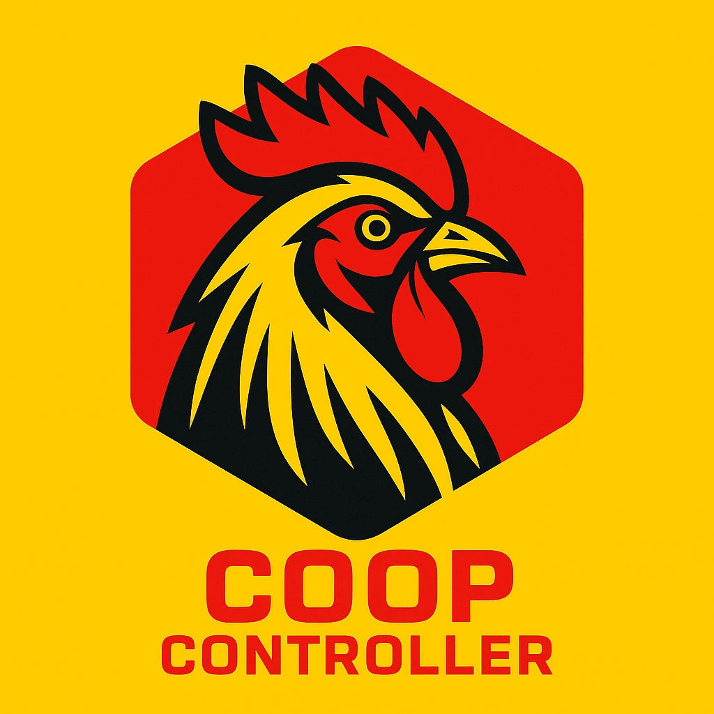

# Coop Controller

ESP32-based automation for chicken coop management: temperature monitoring, freeze prevention, pump control, lighting automation, WiFi management, and a SolidJS web UI for configuration and status.

## Highlights

- Automated pump control with freeze prevention, hysteresis, and flow monitoring
- Dual-purpose sensor inputs (Dallas temp or water meter) with auto-detection
- Smooth PWM lighting control with manual and scheduled modes
- Async web server with OTA updates, logs, and real-time status dashboard
- All settings stored in LittleFS and configurable via web UI

## Build Setup

1. Install Python3 and pip [Python.org](https://www.python.org/downloads/).
2. Install Node.js and npm [Node.js](https://nodejs.org/en/download/).
3. Install PlatformIO and dependencies (see below).
   1. Install [PlatformIO](https://platformio.org/install/ide?install=vscode) (VSCode extension recommended).
   2. Or install PlatformIO Core via pip: `pip install platformio`.
   3. Or use `wget https://raw.githubusercontent.com/platformio/platformio-core-installer/master/get-platformio.py -O /tmp/platformio.py && chmod +x /tmp/platformio.py && python /tmp/platformio.py` (Linux/Mac). 
   4. Or follow [PlatformIO Core installation instructions](https://docs.platformio.org/en/latest/core/installation.html).
4. `source ~/.platformio/penv/bin/activate` (Linux/Mac) or `~\.platformio\penv\Scripts\activate` (Windows) to activate the PlatformIO virtual environment.
5. You may want to add pio to path (`export PATH="$HOME/.platformio/penv/bin:$PATH"` on Linux/Mac or add to Environment Variables on Windows).6. `pip install -r build_scripts/requirements.txt` to install build script dependencies.

## Firmware Installation (ESP32)

1. Flash firmware and filesystem (web tool or PlatformIO Upload Filesystem Image: `pio run -t upload; pio run -t uploadfs`) or flash merged release firmware image: `python $HOME/.platformio/packages/tool-esptoolpy/esptool.py --chip esp32 --port COM22 --baud 115200 --before default_reset --after hard_reset write_flash -z --flash_mode dio --flash_freq 40m --flash_size detect 0x0000 .pio/build/esp32-release/firmware_merged.bin` (adjust COM port and paths as needed).
2. Connect to the temporary WiFi AP `CoopController` (password if defined in platformio.ini).
3. Open [http://192.168.4.1](http://192.168.4.1) or [http://coopcontroller.local](http://coopcontroller.local) to load the UI, enter your WiFi SSID/password, and save settings.
4. After restart, access the device at [http://coopcontroller.local](http://coopcontroller.local) on your network.

## Web UI Development (SolidJS)

- `cd web && npm i`
- `npm run dev` to run with the mock API server.
- Building the filesystem in Platformio automatically builds the web UI and includes it in the filesystem image.

## Project Resources

- Full project guide and hardware/feature details: Agents and architecture notes in [Agents.md](Agents.md)
- PlatformIO configuration and pin definitions: [platformio.ini](platformio.ini)
