# Architecture & System Design

## System Purpose

Coop Controller is an ESP32-based intelligent automation system for chicken coop management. It provides automated control of temperature monitoring, water system management, door automation, lighting, remote monitoring, and alerting.

### Design Philosophy

The system aims for **mostly automated, AI-driven operation** with minimal daily human confirmation, primarily for the security-critical door operation. It leverages weather forecasts, temperature sensors, and historical data to make intelligent decisions while allowing manual overrides.

### Key Functions

1. **Freeze Prevention** - Monitors ambient temperature; activates pump cycling when below threshold (default 34°F) to circulate water and prevent freezing
2. **Door Security** (Planned) - Sunrise/sunset-based door control with AI-powered daily recommendations via weather forecast
3. **Lighting for Production** - PWM dimming with sine-curve transitions, automatic scheduling, manual override with timers
4. **Monitoring & Alerts** (Planned) - Real-time web UI, Email/Telegram notifications, Home Assistant integration

---

## System Architecture

```mermaid
graph TB
    subgraph "Hardware Layer"
        ESP32[ESP32 DevKit C v4]
        TEMP1[Dallas Temp Sensor 1]
        TEMP2[Dallas Temp/Water Meter 2]
        PUMP[Water Pump Relay]
        DOOR[Door Motor DRV8833]
        LIGHT[Light PWM Output]
        HALL1[Hall Sensor Open]
        HALL2[Hall Sensor Closed]
        BUZZER[Buzzer Alert]
    end

    subgraph "Firmware Components"
        MAIN[main.cpp]
        TEMP_MGR[SensorManager]
        PUMP_CTRL[PumpController]
        DOOR_CTRL[DoorController]
        LIGHT_CTRL[LightController]
        SETTINGS[SettingsManager]
        LOGGER[Logger System]
        WEB[WebServer]
        WIFI[WiFi Manager]
    end

    subgraph "External Services"
        WEATHER[OpenWeather API]
        AI[OpenAI Compatible API]
        EMAIL[SMTP Email]
        TELEGRAM[Telegram Bot]
        SYSLOG[Syslog Server]
        HASS[Home Assistant MQTT]
    end

    subgraph "User Interfaces"
        WEBUI[SolidJS Web UI]
        MOBILE[Mobile Browser]
        HA[Home Assistant]
        BOT[Telegram Commands]
    end

    ESP32 --> TEMP1 & TEMP2 & PUMP & DOOR & LIGHT & HALL1 & HALL2 & BUZZER
    MAIN --> TEMP_MGR & PUMP_CTRL & DOOR_CTRL & LIGHT_CTRL & SETTINGS & LOGGER & WEB & WIFI
    TEMP_MGR --> TEMP1 & TEMP2
    PUMP_CTRL --> PUMP
    DOOR_CTRL --> DOOR & HALL1 & HALL2
    LIGHT_CTRL --> LIGHT
    WEB --> WEBUI & MOBILE
    WEBUI --> SETTINGS
    MAIN --> WEATHER & AI & EMAIL & TELEGRAM & HASS
    LOGGER --> SYSLOG
    BOT --> MAIN
    HA --> HASS
```



## Component Interactions

**Core Loop Flow:**

1. **WiFi Management** - Maintains connection, falls back to AP mode if needed
2. **Sensor Updates** - Reads temperature/water flow every 5 seconds
3. **Pump Control** - Updates pump state every 1 second based on temperature and flow
4. **Web Server** - Handles HTTP requests, serves UI, processes OTA updates
5. **Logging** - Maintains in-memory buffer, optional syslog forwarding

**Data Flow:**

- Sensors -> SensorManager -> PumpController -> Physical Output
- User Input (Web UI) -> WebServer -> SettingsManager -> LittleFS Storage
- Status Queries -> WebServer -> Components -> JSON Response
- Alerts -> Logger -> Syslog/Email/Telegram (when implemented)

**State Management:**

- All user settings persisted to `data/user_settings.json` in LittleFS
- Pump statistics tracked in-memory (reset on reboot or manual reset)
- WiFi credentials stored separately from system settings
- Log entries kept in circular buffer (max 150 entries)

---

## Core Components

### SensorManager (`SensorManager.h` / `SensorManager.cpp`)

- **Dual-purpose sensor inputs** - Automatically detects and configures Dallas DS18B20 temperature sensors or water meter pulse inputs on startup. Each pin is independently tested for Dallas sensor first; if none found, it's configured as a water meter input.
- **Temperature readings** - Fahrenheit conversion from Celsius with configurable thresholds. TODO: add setting to display in web UI either C or F
- **Water flow monitoring** - Interrupt-driven pulse counting with atomic operations for thread safety
- **Flow rate calculation** - Gallons per minute based on pulse frequency (60-second calculation interval, TODO: make configurable from UI)
- **Per-pulse calculation** - Optional instantaneous flow measurement calculated after every pulse instead of waiting for fixed intervals, with noise filtering (10ms threshold) and no-flow timeout detection (5 seconds)
- **Noise filtering** - 10ms minimum pulse interval filters electrical noise from water meter signals
- **No-flow timeout** - Automatically detects when flow has stopped (no pulses for 5 seconds)
- **Rollover handling** - Proper millis() overflow handling ensures correct calculations after extended runtime
- **Thread-safe** - Atomic operations protect shared variables in interrupt context
- **Backward compatible** - Default disabled, users can enable via web UI settings
- **Configurable calibration** - Pulses-to-gallons conversion factor (default 450, TODO: make configurable from UI)
- **Real-time status** - Connection state, sensor type, readings, pulse counts

### PumpController (`PumpController.h` / `PumpController.cpp`)

- **Temperature-based automation** - Activates pump when temperature drops below ON threshold (default 34F)
- **Hysteresis control** - Separate ON/OFF thresholds prevent rapid cycling (default 34F ON / 36F OFF)
- **Cycling mode** - Configurable ON/OFF intervals when below threshold (default 5min ON / 10min OFF)
- **Manual control modes** - Force ON, force OFF, or AUTO mode
- **Flow error detection** - Monitors water flow when pump runs; detects frozen/blocked/empty lines
- **Automatic error handling** - Stops pump on flow error, retries on next cycle
- **Flow error timeout** - Configurable timeout (default 120 seconds)
- **Automatic retry** - After configurable delay (default 120 seconds)
- **Statistics tracking** - Total ON/OFF time, cycle counts, current cycle duration
- **State persistence** - Maintains state across updates
- **Pump OFF flow monitoring** - Monitors for water flow when pump is OFF to detect hardware faults (stuck relay, valve leak) with configurable grace period (default 30s) and warning alerts
- **Scheduled maintenance cycles** - Configurable minimum daily cycles

### SettingsManager (`SettingsManager.h` / `SettingsManager.cpp`)

- **Persistent storage** - JSON-based configuration in LittleFS
- **Singleton pattern** - Single global instance accessible via macro
- **WiFi credentials** - SSID, password, AP mode settings
- **System parameters** - Temperature thresholds, pump timings, flow error timeout
- **Auto mode flags** - Enable/disable automatic pump and light control
- **Debug settings** - Toggle debug logging
- **WiFi recovery** - Retry parameters, AP fallback duration
- **Immediate save** - Settings persisted on change
- **Example template** - `user_settings.example.json` for reference

### CoopControllerWebServer (`CoopControllerWebServer.h` / `CoopControllerWebServer.cpp`)

- **Async HTTP server** - Non-blocking request handling using ESPAsyncWebServer
- **REST API** - JSON endpoints for status, settings, and control
- **Static file serving** - Serves SolidJS web UI from LittleFS `/www/` subdirectory
- **OTA support** - Both ArduinoOTA (network) and ElegantOTA (web-based)
- **OTA authentication** - Optional password protection for updates
- **mDNS** - Local discovery at `coopcontroller.local`
- **CORS enabled** - Supports cross-origin requests for development
- **Optional HTTP Basic Authentication** - For state-modifying endpoints (30 protected + 7 public)

### Logger (`Logger.h` / `Logger.cpp`)

- **In-memory buffer** - Circular buffer for last 150 log entries
- **UUID tracking** - Unique identifier for each log entry
- **Timestamp support** - NTP-synchronized timestamps when available
- **Level-specific methods** - logInfo(), logWarning(), logError(), logDebug(), logVerbose() for clear severity indication
- **Automatic filtering** - Debug and verbose messages filtered based on settings
- **JSON export** - REST endpoint for web UI consumption
- **Syslog integration** - Optional remote logging to syslog server
- **Serial output** - Simultaneous logging to Serial monitor

### LightController (`LightController.h` / `LightController.cpp`)

- **PWM dimming control** - ESP32 LEDC (LED Control) peripheral with 8-bit resolution
- **Sine curve transitions** - Smooth fade-in/fade-out following natural lighting curves for auto mode
- **Immediate manual response** - Manual controls work instantly without unwanted fade transitions
- **Configurable timing** - Separate ON/OFF hours with transition duration settings
- **Manual control modes** - Force ON, force OFF, or AUTO mode
- **Timer functionality** - Manual ON with configurable duration (15min, 30min, 1hr, 2hr, 4hr)
- **State machine** - Handles OFF, FADING_IN, ON, FADING_OUT, MANUAL states
- **Settings integration** - Auto mode flag, brightness levels, ON/OFF hours, fade duration
- **REST API** - Manual control endpoints and status reporting
- **Web UI complete** - Full implementation in Status.tsx (controls) and Settings.tsx (configuration)

### SunriseSunset (`SunriseSunset.h` / `SunriseSunset.cpp`)

- **Accurate calculations** - Uses SolarCalculator library for precise sunrise/sunset times
- **UTC to local time** - Automatic conversion from UTC to configured timezone offset
- **Location-based** - Configurable latitude/longitude in settings
- **Timezone support** - User-configurable UTC offset (e.g., -7 for Mountain Time)
- **Automatic updates** - Recalculates when location or timezone settings change
- **Web UI display** - Shows current sunrise/sunset times in Status and Settings pages
- **Ready for automation** - Foundation for door scheduling and light timing enhancements

### WifiController (`WifiController.h` / `WifiController.cpp`)

- **Automatic connection** - Connects to saved SSID on boot
- **Retry logic** - Configurable retry count and delay
- **AP mode fallback** - Creates `CoopController` WiFi network when connection fails
- **Connection persistence** - Tracks successful connections to avoid unneeded AP mode
- **Automatic reconnection** - Monitors connection and retries if dropped
- **mDNS support** - Accessible at `coopcontroller.local` on local network
- **Configurable timeouts** - AP mode duration, retry intervals
- **Clean separation** - Extracted from main.cpp for better code organization
- **Encapsulated state** - All WiFi-related globals moved into controller class

### DoorController (`DoorController.h` / `DoorController.cpp`)

- **Bidirectional motor control** - Via DRV8833 dual H-bridge driver
- **Hall effect position sensors** - Digital output for fully open and fully closed detection
- **Fault detection** - DRV8833 driver fault signal monitoring
- **Manual switch support** - External momentary switch to toggle door open/close
- **Configurable timeouts** - Open/close duration limits
- **State machine** - Handles CLOSED, OPENING, OPEN, CLOSING, STUCK, FAULT states

### BuzzerController (`BuzzerController.h` / `BuzzerController.cpp`)

- **Alert buzzer** - Sounds on fault conditions
- **Configurable patterns** - Different buzz patterns for different alert types
- **Web UI silencing** - Users can silence active buzzer via web UI

---

## Web Interface

- **Real-time status dashboard** - Sensor readings, pump state, light status, sunrise/sunset times, system info
- **Auto-refresh** - Status updates every 2.5 seconds
- **Manual pump controls** - ON/OFF/AUTO buttons with immediate feedback
- **Light controls** - ON/OFF/AUTO buttons, timer selection, brightness display
- **Sunrise/Sunset display** - Shows calculated times based on location and timezone
- **Settings management** - All system parameters configurable including light settings
- **WiFi configuration** - SSID/password entry with AP mode fallback
- **System logs** - Scrollable log viewer with timestamps
- **OTA updates** - Firmware and filesystem update interface
- **Responsive design** - Tailwind CSS with DaisyUI components
- **Dark mode support** - Modern, professional UI

---

## HAL (Hardware Abstraction Layer)

All ESP32-specific functions are abstracted through `IHAL.h` (32 methods):

- **Filesystem:** `fileExists()`, `readFile()`, `writeFile()`, `deleteFile()`, `listFiles()`
- **Web Server:** `createWebServer()`, `on()`, `send()`, `send_P()`, `sendChunked()`, `clientIP()`, `uri()`, `method()`, `arg()`, `hasArg()`, `args()`, `header()`, `hasHeader()`, `headers()`, `authenticate()`, `requestAuthentication()`, `setBasicAuth()`, `serveStatic()`, `serveStaticFromLittleFS()`
- **WiFi:** `WiFiStatus()`, `WiFiSSID()`, `WiFiLocalIP()`, `WiFiMode()`, `beginWiFi()`, `disconnectWiFi()`, `scanNetworks()`
- **LEDC:** `ledcSetup()`, `ledcAttachPin()`, `ledcWrite()`, `ledcDetachPin()`
- **System:** `getResetReason()`, `getFreeHeap()`, `getChipModel()`, `millis()`, `delay()`, `random()`, `taskWdtReset()`

**Implementations:**

- `HAL_ESP32` - Production ESP32 implementation
- `MockHAL` - Desktop testing mock

**Documentation References:**

- HAL Interface: `lib/HAL/IHAL.h`
- ESP32 Implementation: `lib/HAL_ESP32/`
- Mock Implementation: `test/common/mocks/MockHAL.h`

---

## Recent Critical Fixes

### 1. Sunrise/Sunset UTC to Local Time Conversion

**Issue:** Sunrise/sunset calculations were displaying incorrect times due to UTC conversion errors.
**Fix:** Implemented proper UTC to local time conversion using timezone offset. Added automatic recalculation when location or timezone settings change. Web UI displays correct sunrise/sunset times in Status and Settings pages.
**Status:** Complete

### 2. Light Control Regression - Manual vs Auto Mode Fading

**Issue:** Manual light controls were triggering unwanted fade transitions, making immediate control difficult. Auto mode wasn't properly using sine-wave fades.
**Fix:** Manual controls (ON/OFF/Timer) now respond immediately without fade transitions. Auto mode properly implements sine-wave fade-in/fade-out. State machine correctly differentiates between MANUAL and AUTO states.
**Status:** Complete

### 3. Component Naming Refactoring

**Changes:** `TempSensor` -> `SensorManager`, `Buzzer` -> `BuzzerController`, `Light` -> `LightController`
**Benefits:** Consistent naming pattern across all controller classes, more accurate representation of component responsibilities.
**Status:** Complete

### 4. WiFi Controller Refactoring

**Issue:** WiFi management code was scattered throughout main.cpp.
**Fix:** Extracted all WiFi functionality from main.cpp to dedicated WifiController class. Moved WiFi-related global variables into WifiController encapsulation. Implemented proper initialization through begin() method.
**Status:** Complete

### 5. Logger Method Refactoring

**Issue:** Logger used generic log() and logf() methods without clear severity indication, requiring conditional debug checks throughout code.
**Fix:** Replaced all logger calls with level-specific methods (logInfo, logWarning, logError, logDebug, logVerbose). Logger methods now handle filtering internally, eliminating repetitive conditional debug checks.
**Status:** Complete

### 6. HAL (Hardware Abstraction Layer) Refactoring

**Issue:** Direct ESP32 API calls throughout the codebase made unit testing impossible without physical hardware.
**Solution:** Created comprehensive HAL interface (IHAL.h) with 32 methods abstracting all ESP32-specific functionality. Implemented ESP32 HAL (HAL_ESP32) and mock HAL (MockHAL) for desktop testing. Refactored core components (SettingsManager, WifiController, CoopControllerWebServer, LightController) to use HAL interface.
**Build Verification:** ESP32 - RAM 56,444 bytes (17.2%), Flash 1,085,009 bytes (82.8%). Desktop Tests - 2/2 passing (100%).
**Status:** Complete (100% - All ESP32-specific functions abstracted)

### 7. Sensor Error Handling - Already Implemented

**Investigation:** Review revealed sensor error handling was already fully implemented. SensorManager detects DEVICE_DISCONNECTED_C (-127.0C) and sets `is_connected` to false. WebServer returns nullptr for `temperature_f` when disconnected. Status.tsx displays "---F" for null/undefined/NaN values.
**Change:** Updated `web/src/types.ts` to change `temperature_f: number` to `temperature_f: number | null` for proper TypeScript type alignment.
**Status:** Complete

### 8. Pump Flow Per-Pulse Calculation

**Issue:** Previous flow rate calculation used fixed 60-second intervals, which provided delayed response to flow changes.
**Fix:** Added per-pulse flow calculation with noise filtering (10ms threshold), no-flow timeout (5 seconds), atomic operations for thread safety, proper millis() rollover handling. New setting `water_meter_per_pulse_calculation_enabled` (default: false) for backward compatibility.
**Build Verification:** ESP32 - RAM 56,436 bytes (17.2%), Flash 1,081,881 bytes (82.6%). Web UI build successful.
**Status:** Complete

### 9. Pump OFF Flow Monitoring

**Issue:** No monitoring for water flow when pump is OFF, which could indicate hardware faults (stuck relay, valve leak).
**Fix:** Added settings `pump_off_flow_monitoring_enabled` (default: false) and `pump_off_flow_grace_period_seconds` (default: 30). Records timestamp when pump turns OFF and monitors flow rate after grace period. Web UI warning alert banner with "Clear Warning" button. New REST endpoint: `GET /pump/clear_off_flow_detected`.
**Build Verification:** ESP32 - RAM 56,444 bytes (17.2%), Flash 1,084,957 bytes (82.8%). Web UI build successful.
**Status:** Complete

### 10. SPA Routing Fix

**Issue:** Client-side routes like `/update`, `/settings`, `/logs` caused the web server to attempt loading non-existent files from LittleFS, generating filesystem error messages in serial logs.
**Fix:** Reordered web server method registration to ensure static file handlers registered before catch-all handler. Catch-all handler now correctly serves `index.htm` for client-side routes. Removed commented code from HAL implementation.
**Build Verification:** ESP32 - RAM 56,444 bytes (17.2%), Flash 1,085,581 bytes (82.8%).
**Status:** Complete

---

## Project Structure

```
coop_controller/
├── lib/                           # Modular firmware components
│   ├── BuzzerController/          # Buzzer alert control
│   ├── CoopControllerWebServer/   # HTTP server and REST API
│   ├── DoorController/            # Door automation
│   ├── HAL/                       # Hardware abstraction interface (IHAL.h)
│   ├── HAL_ESP32/                 # ESP32 HAL implementation
│   ├── LightController/           # Light control with PWM
│   ├── Logger/                    # Logging system
│   ├── PumpController/            # Pump control logic
│   ├── SensorManager/             # Temperature/water meter handling
│   ├── SettingsManager/           # Configuration management
│   ├── SunriseSunset/             # Sunrise/sunset calculations
│   └── WifiController/            # WiFi management
├── src/
│   └── main.cpp                   # Main entry point and loop
├── data/                          # LittleFS runtime files
│   ├── assets/                    # Web UI static assets (built)
│   ├── www/                       # Web UI served from here
│   └── user_settings.example.json # Template settings file
├── web/                           # SolidJS web application
│   ├── src/
│   │   ├── App.tsx                # Main app component
│   │   ├── Settings.tsx           # Settings management UI
│   │   ├── Status.tsx             # Real-time status dashboard
│   │   ├── Logs.tsx               # Log viewer
│   │   ├── Update.tsx             # OTA update interface
│   │   ├── About.tsx              # About page
│   │   ├── types.ts               # TypeScript interfaces
│   │   └── utils/api.ts           # Authenticated fetch utility
│   ├── devServer.js               # Mock API server for development
│   ├── package.json               # Node dependencies
│   └── vite.config.ts             # Vite build configuration
├── build_scripts/                 # Build automation
│   ├── build_web.py               # Builds web UI and copies to data/
│   ├── post_build.py              # Post-build processing
│   └── merge_bin.py               # Binary merging for releases
├── test/                          # Unit tests
│   ├── common/mocks/              # MockHAL and test utilities
│   ├── test_desktop/              # Desktop unit tests (Google Test)
│   └── test_embedded/             # Embedded unit tests
├── emulate_hardware/              # Hardware emulator (see docs/hardware-emulator.md)
├── docs/                          # Documentation subdocuments
├── platformio.ini                 # PlatformIO configuration
├── Agents.md                      # Project context for AI agents
└── CLAUDE.md                      # Claude Code entry point
```

### File Organization Principles

- **Headers (include/)** - Class definitions and public interfaces
- **Source (src/)** - Implementation details (mainly just `main.cpp` here)
- **Libraries (lib/)** - Modular components for specific functionality, separated for testing and reuse
- **Data (data/)** - Runtime files deployed to ESP32 filesystem
- **Web (web/)** - Complete web application with dev server
- **Tests (test/)** - Unit tests using Google Test framework for desktop/native builds and UnitTest for embedded tests
- **Build Scripts** - Automation for building and deploying

---

## Dependencies

### Firmware Libraries (PlatformIO)

| Library | Version | Purpose |
|---------|---------|---------|
| Arduino framework | Built-in | ESP32 framework |
| esp32async/AsyncTCP | 3.4.7 | Asynchronous TCP |
| esp32async/ESPAsyncWebServer | 3.8.0 | Async HTTP server |
| bblanchon/ArduinoJson | 7.4.2 | JSON handling |
| milesburton/DallasTemperature | 4.0.4 | Temperature sensors |
| SimpleSyslog | 0.1.3 | Remote logging |
| mobizt/ReadyMail | 0.3.6 | SMTP email |
| cotestatnt/AsyncTelegram | 1.1.3 | Telegram integration |
| ayushsharma82/ElegantOTA | 3.1.7 | Web-based OTA |
| robtillaart/UUID | 0.2.0 | UUID generation |
| jpb10/SolarCalculator | 2.0.2 | Sunrise/sunset |
| dawidchyrzynski/home-assistant-integration | 2.1.0 | Home Assistant MQTT |

### Web UI Dependencies (npm)

**Runtime:**

| Package | Version | Purpose |
|---------|---------|---------|
| solid-js | 1.9.5 | Reactive UI framework |
| @solidjs/router | 0.15.3 | Client-side routing |
| tailwindcss | 4.1.10 | Utility-first CSS |
| daisyui | 5.0.43 | Component library |

**Development:**

| Package | Version | Purpose |
|---------|---------|---------|
| vite | 6.2.0 | Build tool |
| typescript | 5.7.2 | Type safety |
